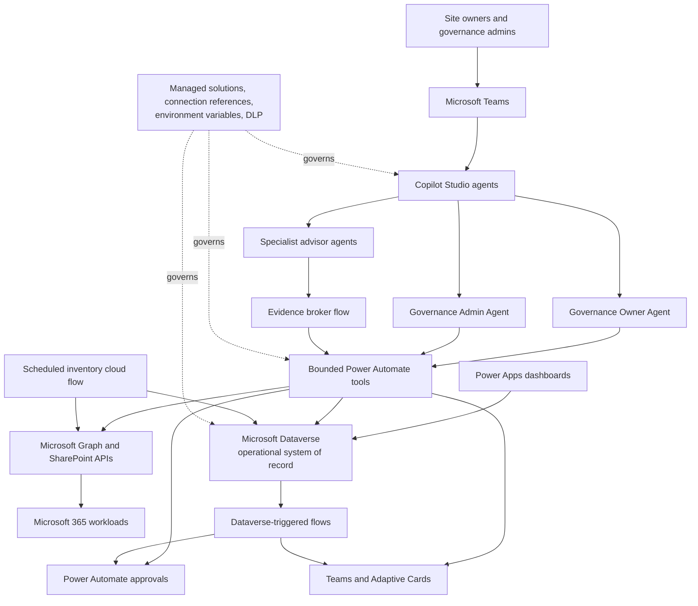

# 02 - Power Platform Architecture

**Solution:** Governor365 / M365 Governance AI Agent  
**Architecture status:** Approved target  
**Last updated:** 2026-09-17

## 1. Decision

The solution uses a Power Platform-first architecture:

- **Microsoft Dataverse** is the application system of record.
- **Power Automate** is the workflow, integration, approval, and notification
  engine.
- **Copilot Studio** hosts the orchestrator, operational agents, and specialist
  advisors.
- **Power Apps** provides optional administrative and owner dashboards.
- **Microsoft Teams** is the primary conversational and notification channel.
- **Microsoft Graph and SharePoint Online APIs** remain authoritative source
  systems for Microsoft 365 resource metadata and approved resource changes.

Azure SQL, SharePoint lists, Logic Apps, and Function Apps are excluded from the
target application architecture. They may appear in historical assets only as
migration sources.

## 2. Logical architecture

## 3. Runtime components

| Component | Platform | Responsibility |
|---|---|---|
| M365 Governance Agent | Copilot Studio | Optional front door and intent router |
| Governance Owner Agent | Copilot Studio | Owner-scoped portfolio, explanations, and requests |
| Governance Admin Agent | Copilot Studio | Admin-verified tenant review and governed actions |
| Specialist advisors | Copilot Studio | Policy, readiness, protection, identity, and assurance guidance |
| Agent tool flows | Power Automate | Stable input/output contracts, identity validation, and Dataverse operations |
| Inventory orchestration | Power Automate | Scheduled collection, paging, work-item creation, and reconciliation |
| Request processor | Power Automate | Authorization, request creation, approvals, execution, callbacks, and status |
| Notification flows | Power Automate | Owner digests, admin summaries, reminders, and Adaptive Card responses |
| Dataverse tables | Dataverse | Canonical operational data, relationships, state, and audit evidence |
| Governance dashboards | Power Apps | Delegable owner and admin views over Dataverse |

## 4. Core request path

1. Copilot Studio obtains the signed-in identity from
   `System.User.PrincipalName`.
2. The agent invokes a solution-aware Power Automate tool with the caller
   identity, operation, and stable record identifier.
3. The flow validates the input and rechecks owner assignment or governance
   admin membership. Model-supplied identity is never trusted.
4. The flow reads or writes Dataverse using connection references.
5. Write operations create a `Governance Action Request` and append one or more
   `Governance Action Event` records.
6. High-impact operations enter a Power Automate approval before any Microsoft
   365 change is attempted.
7. The agent receives a structured response with a tracking ID and truthful
   state such as `PENDING`, `APPROVED`, `COMPLETED`, or `FAILED`.

## 5. Inventory path

1. A scheduled cloud flow creates a `Governance Scan Run`.
2. The flow obtains Microsoft 365 site metadata through approved Microsoft
   Graph or SharePoint administration endpoints.
3. Pagination is mandatory. The parent flow creates bounded `Scan Work Item`
   records rather than processing the entire tenant in one run.
4. Dataverse-triggered worker flows upsert sites by alternate key and replace
   active owner assignments for each processed site.
5. Policy values are loaded from `Governance Policy Setting`.
6. Compliance status, recommended action, evidence timestamps, and scan
   outcomes are written to Dataverse.
7. A finalizer marks stale records, records counts and errors, and completes the
   scan only when all work items have reached a terminal state.

This design supports large tenants without non-delegable client scans or a
single long-running flow.

## 6. Security model

- Owners never receive unrestricted table access through an agent tool.
- Owner tools query active `Site Owner Assignment` rows for the exact normalized
  signed-in UPN or Entra object ID.
- Admin tools verify membership in the configured governance admin Entra group
  on every privileged operation; routing alone is not authorization.
- Power Apps uses Dataverse security roles and admin teams. Direct owner app
  access additionally requires per-site read-only access teams synchronized
  from active owner assignments; an app filter is not authorization. Otherwise
  the owner app uses the same owner-scoped Power Automate tools as the agent.
- Destructive operations use least-privilege connection references, explicit
  confirmation, approval, and audit events.
- Secure inputs and outputs are enabled for flow actions carrying identities,
  evidence, or sensitive connector responses.
- DLP policies place Dataverse, Microsoft 365 Users, Teams, SharePoint, and
  approved HTTP/custom connectors in the business data group.

## 7. ALM and environment strategy

All target components belong to one Power Platform solution:

- Dataverse tables, columns, keys, relationships, choices, and security roles;
- Copilot Studio agents and tools;
- solution-aware cloud flows and child flows;
- Power Apps;
- connection references;
- environment variables;
- custom connectors when an approved standard connector is unavailable.

Use unmanaged solutions in development and managed solutions in test and
production. Deployment configuration must use environment variables, never
hard-coded tenant, environment, group, URL, or connection identifiers.

Recommended environments:

| Environment | Purpose |
|---|---|
| Development | Authoring and unit testing with non-production data |
| Test | Managed-solution deployment, integration tests, and user acceptance |
| Production | Controlled managed deployment with production DLP and service accounts |

## 8. Availability and failure behavior

- Every tool returns an explicit `success` flag, stable status, user-safe
  message, and correlation ID.
- Connector errors do not return empty success-shaped results.
- Failed work items remain visible and retryable in Dataverse.
- Idempotency keys prevent duplicate inventory rows, requests, and event
  processing.
- Notification failures update delivery state and are retried separately from
  the underlying governance request.
- Power Automate run history is operational telemetry; Dataverse stores the
  durable business audit trail.

## 9. Boundaries

SharePoint Online is still governed by the solution. It is not used as the
solution database. PowerShell may be retained temporarily for comparison or
one-time migration, but recurring production automation is implemented in
Power Automate.

See [23-Power-Platform-Refactor.md](23-Power-Platform-Refactor.md) for the
decision record and migration mapping.
