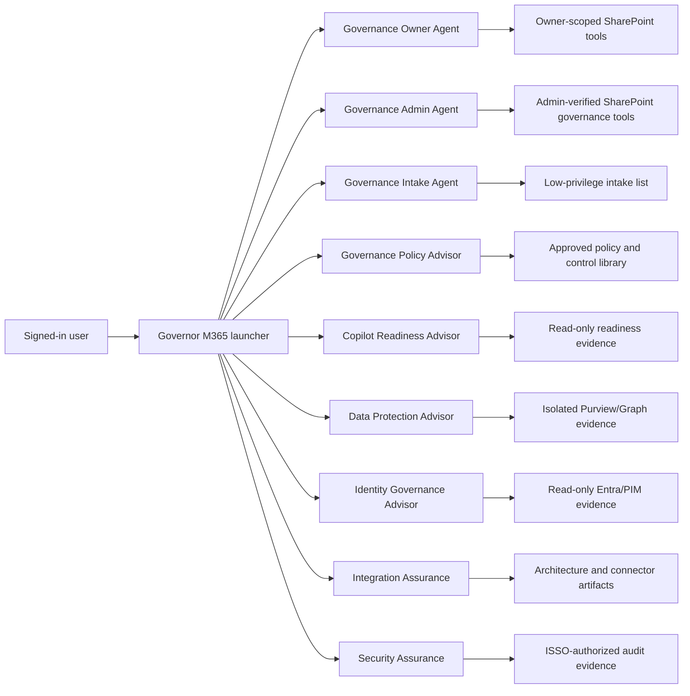

# M365 Governor Capability and Integration Mapping

## Integration decision rules

Use a **child agent** when the capability is a focused task, is maintained with its parent, needs no separate authentication/settings/deployment, is not independently published, and is not reused by other parents.

Use a **connected agent** when the capability has a distinct audience, authorization boundary, connector identity, model/settings, owner/team, release lifecycle, direct channel, or reuse requirement. Connected Copilot Studio agents must be in the same environment, published, connectable, and shared appropriately.

Use a **topic/tool** when the behavior is deterministic, narrow, and can safely share the parent agent's identity and lifecycle.

Use **content only** when the value is prompts, rubrics, templates, taxonomies, or knowledge patterns rather than a separately orchestrated runtime.

Keep a capability **standalone** when its mission or privileged data plane is outside Governor.

## Existing boundaries that must remain intact

| Existing agent | Permitted scope |
|---|---|
| Governor M365 launcher | Greeting, intent classification, clarification, help, and direct handoff only. No assessment, aggregation, data reads, or writes. |
| Governance Owner Agent | Only SharePoint sites owned by the signed-in caller and governed owner requests. It is not an enterprise policy-owner agent. |
| Governance Admin Agent | Tenant-wide SharePoint governance after current-session Governance Admin verification. It does not automatically authorize Entra, Purview, Defender, Sentinel, policy authoring, or security operations. |

## Build-spec mapping

| # | Agent | Governor capability mapping | Integration method | Target home |
|---|---|---|---|---|
| 1 | ACSM IP Repo Librarian | Knowledge governance, approved-source discovery | Content only | Governed knowledge-ingestion process |
| 2 | Cloud RACI & RBAC Designer | Identity governance, access governance, best practices | Connected agent with child/topic methods | Identity Governance Advisor |
| 3 | Azure Lab Tenant Manager | Lab operations | Standalone | Engineering/lab platform |
| 4 | VA RBAC Governance Designer | RBAC, PIM, access review, SoD, federal controls | Merge with #2 | Identity Governance Advisor |
| 5 | Adoption ROI Analyst | Governance reporting, executive dashboard, maturity | Optional child after privacy approval | Governance Insights connected agent |
| 6 | Champion Assistant | Adoption and training | Standalone route | Federal Copilot Academy / adoption service |
| 7 | Data Guard | Data protection, DLP, privacy, classification, oversharing | Child/topic sharing one data-protection boundary | Data Protection Advisor |
| 8 | Incident & Change Agent | Operations, remediation governance, change risk | Content first; later connected ITSM topic | Governance Operations Advisor |
| 9 | Knowledge Manager | Knowledge lifecycle, source quality, audit documentation | Child agent | Governance Policy Advisor |
| 10 | Service Monitor | Operational health and SLA/SLO | Standalone/connected only with telemetry authorization | Service operations |
| 11 | Agent Evaluator | Agent governance, release assurance, regression | Separate assurance agent or CI evaluation harness | Agent Assurance |
| 12 | Roulette Trainer | Training | Ignore in runtime | Standalone training |
| 13 | End-User Trainer | Training and responsible use | Standalone route | Federal Copilot Academy |
| 14 | Feedback Loop | Maturity, reporting, improvement backlog | Later child using aggregate data | Governance Insights |
| 15 | GCC Implementation Advisor | Copilot readiness, federal alignment, rollout | Connected agent with readiness children/topics | Copilot Readiness Advisor |
| 16 | Policy Writer | Policy advisor, regulatory alignment | Child/topic; draft-only | Governance Policy Advisor |
| 17 | Governance Strategist | Assessment, maturity, operating model, roadmap | Connected agent core | Governance Policy Advisor |
| 18 | Integration Validator | Trust boundaries, connector/API assurance, ATO readiness | Connected agent; artifact-only first | Integration Assurance |
| 19 | Performance Assessor | Executive reporting and performance | Standalone or aggregate-only child | Governance Insights |
| 20 | Process Automation | Remediation design and prioritization | Content/tool for design only | Governance Operations Advisor |
| 21 | Security & Compliance Audit | Compliance gaps, audit readiness, federal controls | Connected agent with isolated read-only evidence | Security Assurance |
| 22 | Support Triage | Operations and escalation | Standalone route | Service desk |
| 23 | Feature Governance | Readiness, change risk, rollout gates, lifecycle | Child/topic | Copilot Readiness Advisor |
| 24 | Federal Copilot Academy | Federal training | Standalone route | Training platform |
| 25 | FedOps Use Case Lab | Use-case risk/value/dependency intake | Merge with #38 | Governance Intake Agent |
| 26 | HHS IP Librarian | Agency knowledge discovery | Content only | HHS-owned repository service |
| 27 | HHS Mission Support | Broad mission assistance | Standalone | HHS mission platform |
| 28 | Purview ITIL Advisor | Purview assessment, compliance operations, remediation | Connected agent under distinct Purview/ITSM boundary | Governance Operations Advisor |
| 29 | NIH Prompt Library | Prompt quality and training | Content only | Prompt library |
| 30 | Quick Reference Creator | Governance reporting and job aids | Tool/topic | Policy Advisor or Academy |
| 31 | Risky User Management | Identity/security risk investigation | Standalone SOC agent; summaries only | Security operations |
| 32 | Sanitization Agent | Safe knowledge reuse and publication | Child/tool with ephemeral processing | Governance Policy Advisor |
| 33 | Script Modernization | Engineering governance | Standalone | Engineering platform |
| 34 | SEC EnforceNet Timebound Copilot | Legal hold and case deadlines | Standalone | SEC case platform |
| 35 | Skill MD Builder | Agent development | Ignore in runtime | Developer utility |
| 36 | SOW Visual Designer | Presentation generation | Standalone | Delivery tooling |
| 37 | Sensitive Data Scout/Hound | PII/sensitive data, exposure, permissions, labels | Isolated child within Data Protection Advisor or connected service | Data Protection Advisor |
| 38 | VA Use Case Builder | Governance intake, risk/value/dependencies | Merge with #25 | Governance Intake Agent |
| 39 | VA GCC Helpdesk | Support and GCC qualification | Standalone route | Service desk |
| 40 | Word2Markdown | Knowledge ingestion | Build-time tool | Content pipeline |

## Proposed domain topology

The launcher routes to one destination and does not call multiple agents and synthesize results. Cross-domain reporting should use a governed findings data contract rather than passing raw conversation history or privileged evidence between agents.

## Link-only mapping

| Link-only agent | Provisional mapping | Recommended handling |
|---|---|---|
| ATO Boundary Architect | Integration/Security Assurance | Evaluate after obtaining the build spec; likely content or child in Integration Assurance. |
| ACM Consult Assistant | Adoption/change | Standalone or later Governance Insights child. |
| Champion Role Generator aliases | Adoption/RACI | Content only. |
| Custom Role Creator | Identity governance | Keep advisory and separate until write behavior is known. |
| Federal Narrative Builder | Executive reporting | Standalone formatter or content utility. |
| Intune Operations Integrator | Endpoint operations | Standalone. |
| SEC Copilot ACSM Advisor | Agency adoption/change | Standalone. |
| Security Operating Model Assistant | Security governance | Compare with Strategist/Security Assurance; reuse content first. |
| SOW Creator Assistant | Procurement/delivery | Standalone. |
| VA FOIA vs Benefits Advisor | Agency mission workflow | Standalone. |
| Win365PC Deploy Advisor | Endpoint deployment | Standalone. |

## Data and authorization rules

1. Identity always comes from the signed-in session; prompt text cannot select a caller identity.
2. Routing is never authorization. Every destination verifies its own audience and data scope.
3. Conversation history should be disabled for connected agents unless the task requires it and the transferred content has been threat-modeled.
4. Use explicit task inputs where possible; do not pass raw privileged records through the launcher.
5. Every write requires a fresh resource read, destination-owned authorization, current-turn confirmation, tool-confirmed success, and audit logging.
6. Sensitive Data, Security, Identity, ITSM, and adoption evidence use distinct consent and retention boundaries.
7. Findings shared across agents contain source reference, timestamp, classification, control, confidence, evidence sufficiency, owner, and permitted audience.
8. No downloaded connector, URL, identity, role assignment, or tenant-specific knowledge source is portable by assumption.
