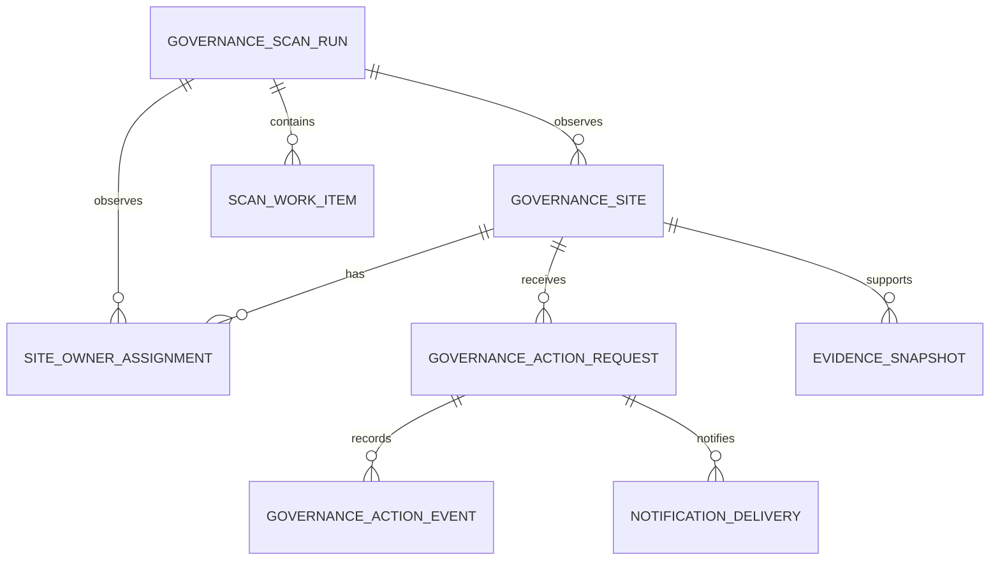

# 04 - Dataverse Data Model

**Solution:** Governor365 / M365 Governance AI Agent  
**Data platform:** Microsoft Dataverse  
**Schema prefix:** `sb`  
**Last updated:** 2026-09-17

## 1. Modeling principles

1. Dataverse is the single operational source of truth.
2. Microsoft 365 resource identity is stable and separate from display names
   and URLs.
3. Site owners are normalized into assignment rows; semicolon-delimited owner
   strings are not used for authorization.
4. Requests and immutable events are separate from the current site snapshot.
5. Alternate keys and idempotency keys make Power Automate upserts safe.
6. Environment variables hold deployment configuration; policy tables hold
   business settings that administrators may change at runtime.

## 2. Table catalog

| Display name | Logical name | Ownership | Purpose |
|---|---|---|---|
| Governance Site | `sb_governancesite` | User or team | Current site inventory and compliance snapshot; owned by the governance operations team and shared read-only through per-site owner access teams when direct Power Apps access is enabled |
| Site Owner Assignment | `sb_siteownerassignment` | Organization | Normalized owner-to-site relationship |
| Governance Action Request | `sb_governanceactionrequest` | Organization | User/admin request and approval lifecycle |
| Governance Action Event | `sb_governanceactionevent` | Organization | Append-only business audit trail |
| Governance Policy Setting | `sb_governancepolicysetting` | Organization | Runtime triage and notification policy |
| Governance Scan Run | `sb_governancescanrun` | Organization | Inventory-run control and summary |
| Scan Work Item | `sb_scanworkitem` | Organization | Bounded asynchronous inventory batches |
| Notification Delivery | `sb_notificationdelivery` | Organization | Digest/card delivery and response status |
| Evidence Snapshot | `sb_evidencesnapshot` | Organization | Time-bound normalized evidence for advisors |

## 3. Governance Site

Primary name: `sb_name`

| Column | Type | Required | Notes |
|---|---|---:|---|
| `sb_governancesiteid` | Unique identifier | Yes | Dataverse primary key |
| `sb_tenantid` | Text (36) | Yes | Entra tenant ID |
| `sb_m365siteid` | Text (200) | Yes | Stable Graph/SharePoint composite site ID |
| `sb_name` | Text (300) | Yes | Site display name |
| `sb_siteurl` | URL | Yes | Current site URL |
| `sb_webid` | Text (36) | No | SharePoint web ID |
| `sb_groupid` | Text (36) | No | Connected M365 group ID |
| `sb_sitetype` | Choice | Yes | Group, Communication, Classic, Other |
| `sb_lifecyclestatus` | Choice | Yes | Active, ReadOnly, Archived, Deleted, Unknown |
| `sb_lastactivityat` | Date/time | No | Latest authoritative activity timestamp |
| `sb_createdat` | Date/time | No | Source-system creation timestamp |
| `sb_storageusagemb` | Decimal | No | Current storage usage |
| `sb_externalsharing` | Choice | No | Disabled, ExistingGuests, NewAndExistingGuests, Anyone, Unknown |
| `sb_office` | Text (200) | No | Organization dimension |
| `sb_suboffice` | Text (200) | No | Organization dimension |
| `sb_directownercount` | Whole number | Yes | Active direct assignments |
| `sb_groupownercount` | Whole number | Yes | Active group-owner assignments |
| `sb_effectiveownercount` | Whole number | Yes | Policy evaluation count |
| `sb_compliancestatus` | Choice | Yes | Compliant, NonCompliant, Unknown |
| `sb_recommendedaction` | Choice | Yes | None, Certify, Archive, DeleteReview, AssignOwners |
| `sb_triagereason` | Multiline text | No | Deterministic plain-language explanation |
| `sb_lastcertifiedat` | Date/time | No | Latest completed certification |
| `sb_attestationstatus` | Choice | Yes | NotAttested, Attested, Expired, Exempt, Unknown |
| `sb_attestationexpiresat` | Date/time | No | Policy-derived expiry |
| `sb_suppressnotificationsuntil` | Date/time | No | Owner/admin suppression boundary |
| `sb_sourceetag` | Text (200) | No | Source concurrency token |
| `sb_lastobservedat` | Date/time | Yes | Last successful source observation |
| `sb_lastscanrun` | Lookup | No | Governance Scan Run |

Alternate key: `(sb_tenantid, sb_m365siteid)`.  
Secondary searchable key: `(sb_tenantid, sb_siteurl)`.

## 4. Site Owner Assignment

| Column | Type | Required | Notes |
|---|---|---:|---|
| `sb_siteownerassignmentid` | Unique identifier | Yes | Primary key |
| `sb_site` | Lookup | Yes | Governance Site |
| `sb_principalobjectid` | Text (36) | No | Entra object ID when resolvable |
| `sb_principalupn` | Text (320) | Yes | Normalized lowercase UPN |
| `sb_displayname` | Text (300) | No | Display only |
| `sb_ownershipsource` | Choice | Yes | SharePoint, M365Group, ManualException |
| `sb_isactive` | Yes/No | Yes | Current assignment marker |
| `sb_observedat` | Date/time | Yes | Source observation timestamp |
| `sb_lastscanrun` | Lookup | No | Governance Scan Run |

Alternate key:
`(sb_site, sb_principalupn, sb_ownershipsource)`.

Agent owner queries start with this table and use active exact matches. They
never scan a text field on Governance Site. A direct owner Power App may rely on
Dataverse row sharing through an access-team template; an app filter alone is
not an authorization boundary.

## 5. Governance Action Request

| Column | Type | Required | Notes |
|---|---|---:|---|
| `sb_governanceactionrequestid` | Unique identifier | Yes | Primary key and tracking ID |
| `sb_site` | Lookup | No | Optional only for general support |
| `sb_requesttype` | Choice | Yes | Certify, Archive, DeleteReview, AssignOwner, Support |
| `sb_requeststatus` | Choice | Yes | Pending, AwaitingApproval, Approved, InProgress, Completed, Rejected, Cancelled, Failed |
| `sb_requestedbyobjectid` | Text (36) | No | Signed-in Entra object ID |
| `sb_requestedbyupn` | Text (320) | Yes | Normalized signed-in UPN |
| `sb_requestedat` | Date/time | Yes | UTC |
| `sb_reason` | Multiline text | No | User-supplied business reason |
| `sb_targetownerupn` | Text (320) | No | Assign-owner target |
| `sb_confirmationmethod` | Choice | No | Button, TypedConfirm, AdminApproval |
| `sb_approvedbyupn` | Text (320) | No | Approval actor |
| `sb_approvedat` | Date/time | No | UTC |
| `sb_completedat` | Date/time | No | UTC |
| `sb_externaloperationid` | Text (200) | No | M365/approval correlation |
| `sb_idempotencykey` | Text (200) | Yes | Unique caller/site/type/submission token |
| `sb_failurecode` | Text (100) | No | Stable operational code |
| `sb_failuremessage` | Multiline text | No | Sanitized operational detail |

Alternate key: `sb_idempotencykey`.

## 6. Governance Action Event

Action events are append-only from the application perspective.

| Column | Type | Required | Notes |
|---|---|---:|---|
| `sb_governanceactioneventid` | Unique identifier | Yes | Primary key |
| `sb_request` | Lookup | Yes | Governance Action Request |
| `sb_eventtype` | Choice | Yes | Submitted, Authorized, ApprovalRequested, Approved, Rejected, ExecutionStarted, Completed, Failed, Notified |
| `sb_eventat` | Date/time | Yes | UTC |
| `sb_actorupn` | Text (320) | No | Human or service actor |
| `sb_correlationid` | Text (100) | Yes | Flow/request correlation |
| `sb_message` | Multiline text | No | Sanitized business event detail |
| `sb_previousstate` | Text (100) | No | State before transition |
| `sb_newstate` | Text (100) | No | State after transition |

Use a Dataverse security role that allows create/read but not update/delete for
flow service accounts and governance reviewers.

## 7. Policy, scan, work, and notification tables

### Governance Policy Setting

Key columns: `sb_key` (alternate key), `sb_valuetype`, `sb_value`,
`sb_description`, `sb_isactive`, `sb_effectivefrom`, and `sb_effectiveto`.
Initial keys:

- `StaleMonths`
- `CertificationMonths`
- `MinimumOwners`
- `MaximumOwners`
- `LowUsageThreshold`
- `NotificationSuppressionDays`
- `AttestationExpiryDays`

### Governance Scan Run

| Column | Type | Required | Notes |
|---|---|---:|---|
| `sb_governancescanrunid` | Unique identifier | Yes | Primary key |
| `sb_name` | Text (300) | Yes | Human-readable run name |
| `sb_runid` | Text (36) | Yes | Alternate key and external correlation value |
| `sb_status` | Choice | Yes | Running, Completed, CompletedWithErrors |
| `sb_startedat` | Date/time | Yes | UTC start |
| `sb_completedat` | Date/time | No | UTC terminal time |
| `sb_sourcewatermark` | Multiline text | No | Minimized continuation/watermark state |
| `sb_sitesdiscovered` | Whole number | Yes | Source enumeration count |
| `sb_sitesprocessed` | Whole number | Yes | Successfully reconciled count |
| `sb_recordsfailed` | Whole number | Yes | Failed site/work-item count |
| `sb_correlationid` | Text (36) | Yes | Troubleshooting correlation ID |

Alternate key: `sb_runid`.

### Scan Work Item

| Column | Type | Required | Notes |
|---|---|---:|---|
| `sb_scanworkitemid` | Unique identifier | Yes | Primary key |
| `sb_name` | Text (300) | Yes | Human-readable batch name |
| `sb_scanrun` | Lookup | Yes | Parent Governance Scan Run |
| `sb_idempotencykey` | Text (200) | Yes | Scan run plus stable source page token |
| `sb_pagetoken` | Multiline text | No | Minimized continuation token or page reference |
| `sb_status` | Choice | Yes | Pending, InProgress, Completed, Failed |
| `sb_attemptcount` | Whole number | Yes | Bounded retry counter |
| `sb_nextattemptat` | Date/time | No | Retry eligibility time |
| `sb_discoveredcount` | Whole number | Yes | Source rows in the batch |
| `sb_processedcount` | Whole number | Yes | Successfully reconciled rows |
| `sb_errorcode` | Text (100) | No | Stable sanitized failure code |
| `sb_errormessage` | Multiline text | No | Sanitized diagnostic with correlation ID |

Alternate key: `(sb_scanrun, sb_idempotencykey)`.

### Notification Delivery

Key columns: recipient UPN, notification type, period key, status, sent time,
response time, request lookup, Teams activity ID, idempotency key, and failure
detail.

### Evidence Snapshot

Key columns: resource lookup, evidence type, observed time, expiry time, source,
classification, correlation ID, and minimized JSON payload. Large documents
remain in an approved governed repository and are referenced, not copied into
general agent knowledge.

## 8. Relationships

## 9. Security roles

| Role | Access |
|---|---|
| Governor365 Owner App User | User-level read on Governance Site; shared records only through per-site owner access teams; requests through flows |
| Governor365 Governance Admin | Read all operational tables; update approved policy/site fields; approve governed requests |
| Governor365 Auditor | Read sites, requests, events, scans, and evidence; no write/delete |
| Governor365 Flow Service | Least-privilege create/read/write required by each connection reference; no action-event update/delete |
| Governor365 Maker | Development environment customization only |

Agents do not rely on these roles alone. Each Power Automate tool rechecks the
signed-in caller against assignment or admin membership.

When direct owner Power Apps access is enabled, an assignment reconciliation
flow must add/remove licensed Dataverse users from the site's read-only access
team as active owner assignments change. Without that control, the owner app
must use the same owner-scoped Power Automate read tools as Copilot Studio.

## 10. Retention and auditing

- Enable Dataverse auditing for policy settings, sites, owner assignments, and
  requests.
- Retain action events according to the organization's governance record
  schedule.
- Minimize personal data to object ID, UPN, display name, and action evidence
  needed for authorization and audit.
- Define purge/anonymization flows for expired notification and evidence records.
- Do not store connector secrets, access tokens, or full raw Graph responses.
