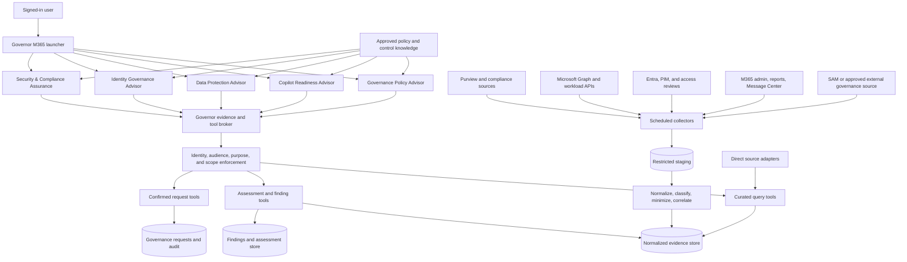

# Advisor Agent Integration Architecture

> **Architecture update (2026-09-17):** Dataverse and Power Automate replace
> Azure SQL and Azure-hosted broker proposals in the approved target. Retain
> the evidence contracts and agent boundaries in this document, but implement
> storage and orchestration per `../../docs/23-Power-Platform-Refactor.md`.

## Decision

Integrate the five domain advisors through a shared, governed evidence plane.
Reuse approved instructions, rubrics, taxonomies, and business
methods as the reasoning plane; do not treat their static context as evidence of
the current tenant.

Use a hybrid acquisition model:

1. **Direct, on-demand adapters** for facts that must be current when a user asks
   or approves an action.
2. **Scheduled collectors** for tenant-wide inventory, expensive correlation,
   historical trends, and repeatable assessments.
3. **Governed knowledge collections** for approved policies, control baselines,
   Microsoft guidance, templates, and other versioned reference material.
4. **Human-supplied assessment input** for business decisions that cannot be
   discovered technically, such as risk appetite, accountable roles, and
   accepted exceptions.

The default serving path is normalized evidence and findings, not unrestricted
source-system access. The launcher routes requests but never reads evidence,
calls source systems, or combines privileged results.

## Why this architecture

The new agents provide valuable know-how but cannot reliably answer questions
such as "which sites are overshared?", "which privileged roles are stale?", or
"is this GCC feature available in our tenant?" from instructions alone.
Conversely, giving every declarative agent broad access to Purview, Entra, and
Microsoft Graph would duplicate connector logic, increase consent and audit
surface, and make cross-domain answers inconsistent.

M365 Governor already demonstrates the required pattern:

- a backend scan compiles site inventory;
- Azure SQL provides a scalable operational read model;
- a deterministic flow returns owner-scoped records;
- agents explain and act on the returned facts;
- write requests are reauthorized, confirmed, and audited.

The advisor expansion should generalize that pattern from a site inventory into
a governed evidence platform. It should not create one custom integration stack
per agent.

## Target architecture



## Architectural planes

### 1. Experience and reasoning plane

Copilot Studio hosts the launcher and five connected domain agents. Each domain
agent owns its specialized instructions and may use child agents, topics, or
prompts for methods that share the same authorization boundary.

The imported source-agent content belongs here when it describes:

- assessment questions and decision trees;
- maturity models and scoring rubrics;
- risk and control mappings;
- recommended response patterns;
- policy and report templates;
- federal and GCC considerations;
- uncertainty and escalation rules.

Instructions tell the agent **how to interpret evidence**. They are not proof
that a tenant resource has a label, a DLP policy applies, or a role was reviewed.

### 2. Tool and authorization plane

All operational access passes through stable tools rather than model-authored
queries. A Power Automate flow is sufficient for small deterministic operations.
A managed API is preferred when pagination, fan-out, correlation, long-running
work, large payloads, or reusable policy enforcement makes flows unwieldy.

Every tool must:

- derive caller identity from the authenticated session;
- map the caller to an approved domain audience;
- enforce resource and tenant scope independently of agent routing;
- accept explicit, typed task inputs;
- return a bounded, versioned response;
- include source time, freshness, classification, and evidence references;
- deny on connector, authorization, or freshness failure;
- log the caller, purpose, tool version, scope, and outcome;
- exclude raw secrets, access tokens, and unnecessary content.

Tool identities are domain-specific. A Data Protection connector does not grant
the Policy Advisor access to Purview, and Governance Admin membership does not
implicitly grant access to Entra or security evidence.

### 3. Evidence and findings plane

Extend the current Azure SQL direction into a normalized evidence and findings
store. Keep the existing site inventory as a resource source, but do not keep
adding unrelated domain columns to the site table.

Use separate logical schemas or equivalent stores for:

| Entity | Purpose |
|---|---|
| `Resource` | Canonical tenant resources: site, team, group, policy, role, agent, feature, or control. |
| `EvidenceSnapshot` | Collection run, source system, adapter version, collected/valid times, tenant, classification, and status. |
| `EvidenceFact` | Typed, minimized facts linked to a resource and snapshot. |
| `Relationship` | Resource relationships such as site-to-group, group-to-owner, policy-to-workload, or role-to-principal. |
| `Finding` | Normalized cross-domain issue with severity, confidence, lineage, recommendation, audience, and status. |
| `Assessment` | Reproducible execution of a versioned rubric against evidence and human responses. |
| `ControlCatalog` | Approved control baseline, revision, applicability profile, owner, and interpretation authority. |
| `PolicySource` | Approved policy metadata, version, effective date, classification, review date, and content location. |
| `CapabilityClaim` | Cloud-specific feature or connector claim with authoritative source, retrieval date, and revalidation date. |
| `GovernanceRequest` | Confirmed request or proposed remediation linked to findings and existing action audit. |

Large or sensitive artifacts should remain in their approved source repository
or a restricted evidence store. SQL should retain metadata, derived facts,
hashes, and source references unless copying the artifact is explicitly
approved. General agent knowledge must never become a cache for raw Purview,
security, investigation, CUI, PII, or personnel data.

### 4. Collection and source-adapter plane

Implement each source as a versioned adapter with a common collection envelope:

```json
{
  "tenantId": "target-tenant",
  "sourceSystem": "source-name",
  "adapterVersion": "1.0",
  "collectionId": "correlation-id",
  "collectedAt": "UTC timestamp",
  "validAsOf": "UTC timestamp",
  "classification": "approved classification",
  "scope": "authorized resource or domain scope",
  "status": "COMPLETE | PARTIAL | FAILED",
  "records": []
}
```

Adapters can be implemented with an available first-party connector, a
destination-owned custom connector, or a scheduled backend collector. The
contract stays constant if the underlying integration changes.

## Direct connector versus scheduled collection

Choose per dataset, not per agent.

| Use direct on-demand access when | Use scheduled collection when |
|---|---|
| The fact can change between scans and affects the current answer or approval. | A tenant-wide query is expensive, throttled, asynchronous, or spans multiple APIs. |
| The query is narrowly scoped to a selected resource. | The advisor needs baselines, deltas, trends, or prioritization across resources. |
| Source-side security trimming must be evaluated at request time. | Raw source access should be isolated from interactive agent identities. |
| The source can meet interactive latency and availability requirements. | A stable read model is needed despite source latency or temporary outage. |
| Returning a small minimized result is practical. | Correlation or group expansion must be computed before serving results. |

Use both for high-impact decisions: serve the latest completed baseline, then
perform a fresh, scoped validation before a write or definitive current-state
claim. If the fresh validation fails, label the baseline stale and do not report
the operation as verified.

## Domain source and tool map

### Data Protection Advisor

**Know-how to reuse:** sensitive-data discovery methodology, exposure scoring,
label/DLP/retention analysis, privacy considerations, and remediation guidance.

**Required evidence:**

- SharePoint, OneDrive, and Teams resource inventory;
- sharing capability, anonymous/company links, guests, and external users;
- group and nested-group membership relevant to exposure;
- sensitivity label and retention state;
- applicable DLP, retention, and information-protection policy coverage;
- approved Purview findings or aggregate sensitive-information indicators;
- source timestamps and scan coverage.

**Acquisition strategy:**

- reuse the current site inventory and normalized ownership relationships;
- collect tenant-wide permission and policy baselines on a schedule;
- use direct, resource-scoped validation for a selected site's current sharing,
  permissions, label, and policy applicability;
- prefer approved Purview summary/metadata interfaces over content export;
- if a first-party Purview/SAM connector is unavailable in the target cloud,
  build an isolated collector or custom connector behind the same contract.

**Initial tools:**

- `GetDataProtectionPortfolio(scope, filters, pageToken)`
- `GetResourceExposure(resourceId)`
- `GetProtectionCoverage(resourceId)`
- `RunDataProtectionAssessment(scope, rubricVersion)`
- `GetFindingEvidence(findingId)`

The agent may recommend remediation but must not change labels, sharing, DLP, or
retention in the first release.

### Copilot Readiness Advisor

**Know-how to reuse:** GCC implementation phases, dependency sequencing,
readiness questions, rollout gates, training/ATO considerations, and feature
governance.

**Required evidence:**

- tenant cloud/profile and approved target personas;
- licensing and service-plan summaries;
- identity, device, network, app, and governance prerequisite status;
- Purview and data-protection readiness summaries;
- approved agent inventory and lifecycle status;
- Message Center/service-change records relevant to the target cloud;
- authoritative Microsoft feature availability claims;
- human responses for mission, schedule, risk appetite, training, and ATO.

**Acquisition strategy:**

- collect configuration and licensing summaries on a schedule;
- maintain capability claims as short-lived, source-dated records;
- query current service health or feature claims on demand when practical;
- request human input only for non-discoverable business decisions.

**Initial tools:**

- `GetReadinessBaseline(profileId)`
- `CheckPrerequisite(prerequisiteId, scope)`
- `GetCapabilityClaim(featureId, cloud)`
- `ListRelevantServiceChanges(profileId, since)`
- `RunReadinessAssessment(profileId, rubricVersion, responses)`

No tool in this domain configures the tenant or represents that readiness equals
an authorization to operate.

### Identity Governance Advisor

**Know-how to reuse:** RACI/RBAC design, least privilege, PIM, access review,
separation-of-duty, and federal identity-control mapping.

**Required evidence:**

- role definitions and active/eligible assignments;
- principal type and approved organizational metadata;
- PIM policy and activation summaries;
- access-review definitions, decisions, completion, and recency;
- privileged group ownership and membership relationships;
- approved SoD rules and RACI/accountability inputs;
- current site/group ownership facts when relevant.

**Acquisition strategy:**

- collect role and relationship baselines on a schedule;
- calculate stale assignment and SoD candidates in the backend;
- perform direct validation before presenting a selected assignment as current;
- minimize person-level attributes and restrict detailed evidence to authorized
  identity-governance audiences.

**Initial tools:**

- `GetIdentityGovernanceSummary(scope)`
- `ListPrivilegedAssignments(filters, pageToken)`
- `GetAssignmentEvidence(assignmentId)`
- `EvaluateSeparationOfDuties(scope, ruleSetVersion)`
- `RunRbacAssessment(scope, rubricVersion)`

The first release is read-only and cannot activate, assign, revoke, or approve a
role.

### Governance Policy Advisor

**Know-how to reuse:** maturity models, operating-model design, policy gap
analysis, policy drafting, KPI selection, and knowledge lifecycle practices.

**Required evidence:**

- approved policies, standards, procedures, and control baselines;
- policy ownership, approval, effective date, and supersession metadata;
- aggregate normalized findings from the other domains;
- approved organizational profile, governance bodies, and decision rights;
- human responses for strategy, risk appetite, and desired operating model;
- approved, aggregate capability/service-change findings from Copilot
  Readiness when policy review is required.

**Acquisition strategy:**

- use governed SharePoint or other approved repositories for document content;
- index only approved, current, audience-appropriate material;
- read aggregate findings, not raw identity, Purview, or security evidence;
- collect document lifecycle metadata and capability changes on a schedule.

**Initial tools:**

- `SearchApprovedPolicy(query, profileId)`
- `GetPolicyLifecycleStatus(policyId)`
- `GetAggregateGovernanceFindings(profileId, filters)`
- `RunMaturityAssessment(profileId, rubricVersion, responses)`
- `DraftPolicyArtifact(templateId, approvedInputs, evidenceRefs)`

All generated artifacts remain drafts. Publication, approval, and enforcement
stay in human-owned workflows.

### Security & Compliance Assurance

**Know-how to reuse:** control mapping, evidence sufficiency, audit workpapers,
gap analysis, risk prioritization, and NIST/FedRAMP alignment.

**Required evidence:**

- approved control catalogs and applicability profiles;
- normalized findings from Data Protection, Identity, and Readiness;
- ISSO-approved security, audit, Defender, Purview, and configuration summaries;
- evidence owners, collection lineage, validity periods, and exceptions;
- remediation status and closure evidence.

**Acquisition strategy:**

- isolate security collectors and their credentials from all other advisors;
- ingest only approved evidence summaries and references;
- schedule repeatable control snapshots;
- use direct checks only for authorized, scoped evidence validation;
- never route raw investigation or sensitive event records through Governor.

**Initial tools:**

- `GetControlAssessmentSummary(profileId, filters)`
- `GetControlEvidence(controlId, scope)`
- `EvaluateEvidenceSufficiency(controlId, rubricVersion)`
- `RunComplianceAssessment(profileId, baselineRevision)`
- `CreateRemediationProposal(findingIds)`

The agent cannot accept risk, certify compliance, close an audit issue, or
enforce remediation.

## Common finding contract

Every assessment-producing tool returns findings in one contract:

```json
{
  "findingId": "stable-id",
  "domain": "DATA_PROTECTION",
  "resourceId": "canonical-resource-id",
  "title": "Concise finding",
  "severity": "LOW | MEDIUM | HIGH | CRITICAL",
  "riskScore": 0,
  "confidence": 0,
  "evidenceSufficiency": "SUFFICIENT | PARTIAL | INSUFFICIENT",
  "evidenceRefs": ["immutable-reference"],
  "sourceCollectedAt": "UTC timestamp",
  "validUntil": "UTC timestamp or null",
  "controlRefs": ["control-id"],
  "classification": "approved classification",
  "permittedAudience": ["audience-id"],
  "recommendation": "advisory next step",
  "status": "OPEN | ACCEPTED | IN_PROGRESS | RESOLVED | DISMISSED"
}
```

Risk scoring must be implemented and versioned in assessment code or a
deterministic rules service. The model can explain a score but must not silently
invent or alter it.

## Request and handoff contract

The launcher passes only:

- authenticated caller context supplied by the platform;
- destination agent identifier;
- explicit intent and resource references;
- optional non-sensitive user-entered parameters.

Conversation history is off by default for advisor handoffs. The destination
agent obtains authorized evidence through its own tools. Cross-domain agents
exchange finding IDs or aggregate assessment IDs, never raw source records.

Any future remediation follows the existing Governor pattern:

1. retrieve a fresh resource/evidence record;
2. reauthorize the caller for that exact operation;
3. show impact and obtain current-turn confirmation;
4. create a pending governance request;
5. execute through a separately approved workflow;
6. record outcome and closure evidence.

## Source selection and connector policy

For each dataset, create a source decision record with:

- authoritative system of record;
- target cloud and API/connector availability;
- delegated versus application identity;
- minimum read permissions and consent owner;
- tenant/resource scope and audience;
- data classification and prohibited fields;
- direct or scheduled collection mode;
- paging, throttling, retry, and partial-result behavior;
- freshness objective and stale-data behavior;
- retention, deletion, and legal-hold treatment;
- revocation and incident-response procedure;
- reconciliation rule when Purview, SAM, Graph, or local inventory disagree.

Do not bind agent instructions to a connector product name. A tool contract
such as `GetProtectionCoverage` should remain stable whether its approved source
is a built-in connector, Graph, Purview, SAM, or a backend scan.

## Phased implementation

### Phase A - Shared evidence foundation

1. Define the canonical resource, snapshot, fact, relationship, finding,
   assessment, capability-claim, and policy-source schemas.
2. Add an adapter registry, source decision record, and collection-run audit.
3. Implement caller/audience enforcement and versioned tool response envelopes.
4. Import the existing SQL site inventory as the first canonical resource feed.
5. Build a small approved-policy collection and versioned rubric registry.

**Exit gate:** one site fact and one policy fact can be traced from an advisor
response to source, collection time, adapter version, and permitted audience.

### Phase B - Low-privilege advisory MVP

1. Implement Governance Policy Advisor on approved knowledge plus aggregate
   findings.
2. Implement Copilot Readiness Advisor using capability claims, the agent
   registry, human assessment inputs, and approved configuration summaries.
3. Persist assessment versions and reproducible results.

**Exit gate:** policy output is draft-only, readiness claims are cloud- and
source-dated, and rerunning an unchanged rubric against the same snapshot
produces the same scored result.

### Phase C - Read-only domain evidence

1. Add Data Protection collectors and scoped validation tools.
2. Add Identity Governance collectors and scoped validation tools.
3. Add isolated Security & Compliance evidence adapters last.
4. Expose normalized findings to Policy and Readiness without exposing raw
   evidence.

**Exit gate:** each domain passes authorization, leakage, stale-data, partial
collection, pagination, poisoned-source, and connector-revocation tests.

### Phase D - Governed remediation

1. Map approved finding types to pending governance request types.
2. Add human assignment, approval, rollback, closure, and evidence requirements.
3. Keep source-system writes in separate, least-privilege executors.

**Exit gate:** no recommendation can become a source-system change without a
fresh read, exact authorization, explicit confirmation, audit record, and
verifiable tool result.

## First implementation slice

Start with a Data Protection site assessment because it reuses the most mature
Governor asset and tests the architecture end to end:

1. register the existing SQL site row as a canonical `Resource`;
2. add scheduled facts for sharing mode, guest/external counts, group
   relationship, label metadata, policy coverage, and collection completeness;
3. add `GetResourceExposure(resourceId)` with Data Protection audience checks;
4. implement a versioned oversharing rubric that produces normalized findings;
5. allow the advisor to explain those findings using the Data Guard and
   Scout/Hound methods;
6. validate one known-safe, one overshared, one partially scanned, and one
   unauthorized site scenario.

This slice is more valuable than starting with a broad tenant chat experience:
it proves source collection, normalization, authorization, business-rule
execution, explanation, and lineage using a resource type Governor already
understands.

## Decisions still requiring tenant validation

Before production implementation, validate:

1. which Purview, Graph, Entra, Message Center, Defender, SAM, and Power Platform
   connectors/APIs are available in the target GCC profile;
2. whether each source supports the required delegated or application access;
3. the approved security groups for all five advisors;
4. retention and records treatment for evidence, findings, prompts, and outputs;
5. whether Azure SQL remains the approved structured evidence store and which
   repository holds restricted artifacts;
6. freshness objectives and maximum interactive latency per tool;
7. control-baseline owners and scoring/rubric approval authorities.

These validations may change adapter implementations, but they should not change
the agent boundaries, common evidence contracts, or fail-closed behavior.

The detailed build sequence, component backlog, multi-agent orchestration rules,
and release gates are defined in
[09-Advisor-Implementation-Roadmap.md](09-Advisor-Implementation-Roadmap.md).
