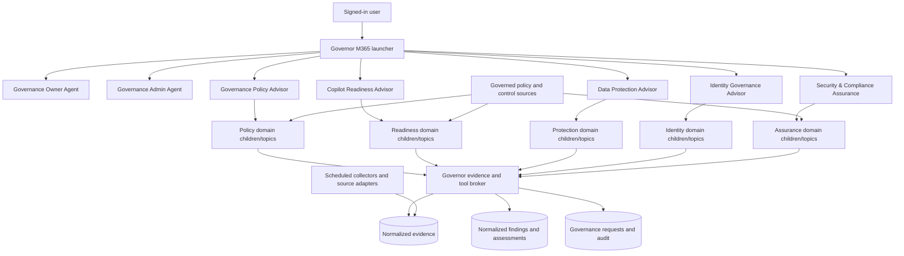
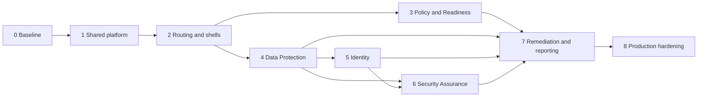

# M365 Governor Advisor Implementation Roadmap

> **Architecture update (2026-09-17):** Implement registry, evidence, findings,
> and orchestration capabilities with Dataverse and Power Automate. Azure SQL,
> Logic App, Function App, and managed-API items below are historical options
> superseded by `../../docs/23-Power-Platform-Refactor.md`.

## Purpose

This roadmap turns the final advisor integration architecture into buildable
work. It covers the Governor topology, agents, child agents, prompts, tools,
connectors, data services, security controls, evaluation, ALM, and rollout
sequence required to introduce the five domain advisors safely.

This roadmap complements:

- [agent-catalog.md](agent-catalog.md), which defines the runtime components;
- [personas.md](personas.md), which defines audiences and interaction behavior;
- [implementation.md](implementation.md), which defines the current delivery state;
- [08-Advisor-Agent-Integration-Architecture.md](08-Advisor-Agent-Integration-Architecture.md),
  which defines the evidence and tool architecture;
- [architecture.md](architecture.md), which defines current agent
  responsibilities and security invariants.

## Executive implementation decision

Build a **two-level hub-and-domain architecture**:

1. **Governor M365 launcher** performs discovery, intent classification, and one
   direct handoff.
2. **One destination domain agent** owns the user turn and orchestrates its own
   focused child agents, topics, knowledge, and tools.

Do not build a free-form agent mesh. Do not let the launcher call several domain
agents and synthesize privileged results. Do not have one domain orchestrator
call another domain orchestrator at runtime.

When a cross-domain answer is required, the destination agent reads authorized,
normalized findings through the evidence broker. For example, Security &
Compliance Assurance reads approved Data Protection and Identity finding
records; it does not invoke those two advisor agents.

This topology provides:

- one routing decision at the launcher;
- no more than one additional generative planning layer per user turn;
- stable authorization and connector ownership per domain;
- lower latency and fewer duplicate responses;
- independently testable and publishable domain agents;
- a shared evidence plane without shared connector credentials.

## Guidance basis

The roadmap applies the following Microsoft Copilot Studio guidance, reviewed
September 16, 2026:

- [Add other agents overview](https://learn.microsoft.com/en-us/microsoft-copilot-studio/authoring-add-other-agents):
  use child agents for focused tasks that share configuration, authentication,
  ownership, deployment, and reuse boundaries; use connected agents when those
  boundaries differ. Microsoft notes that additional orchestration hops add
  latency and management surface, and that selection quality can degrade as
  action choices grow or descriptions overlap.
- [Multi-agent orchestration patterns and best practices](https://learn.microsoft.com/en-us/microsoft-copilot-studio/guidance/multi-agent-patterns):
  separate agents only for meaningful domain, knowledge, reuse, or governance
  boundaries; use distinct descriptions and nonoverlapping knowledge; define
  who owns the user response; correlate parent and connected-agent telemetry.
- [Connect to an existing Copilot Studio agent](https://learn.microsoft.com/en-us/microsoft-copilot-studio/add-agent-copilot-studio-agent):
  connected agents must be in the same environment, published, connectable, and
  shared appropriately. Conversation-history transfer is configurable and
  connected-agent descriptions are maintained locally by the caller.
- [Add a child agent](https://learn.microsoft.com/en-us/microsoft-copilot-studio/add-agent-child-agent):
  child agents can own focused instructions, knowledge, and tools; explicit
  inputs and outputs should be used where deterministic contracts are needed.
- [Orchestrate agent behavior with generative AI](https://learn.microsoft.com/en-us/microsoft-copilot-studio/advanced-generative-actions):
  names, descriptions, and input/output metadata strongly influence selection.
  Components should return outputs rather than duplicate user-facing messages
  when a parent orchestrator owns the response.

Some multi-agent capabilities remain preview or can differ by cloud. Every
planned capability is therefore gated by validation in the target GCC profile.

## Target Governor topology



### Interaction ownership

The launcher uses a **transfer-of-ownership** pattern:

1. classify the request;
2. ask at most one routing clarification when necessary;
3. hand off directly to one connected domain agent;
4. do not restate or synthesize the domain answer.

Within a domain, the domain agent is the only responder for that turn. Child
agents return structured findings or natural-language research to their parent
and do not independently send a second final response.

This is a deliberate implementation of the single-response principle. It avoids
the alternative pattern where the launcher remains the final responder and must
receive privileged domain results.

### Maximum orchestration depth

The normal path is:

```text
Launcher -> connected domain agent -> child/topic/tool
```

The following runtime paths are prohibited:

```text
Launcher -> domain orchestrator -> connected domain orchestrator -> child
Launcher -> multiple domain agents -> launcher synthesis
Domain agent -> peer domain agent -> peer tool
Child agent -> connected agent
```

Exceptions require an architecture decision record with measured latency,
routing accuracy, authorization, transcript ownership, and rollback behavior.

## Agent boundary decision matrix

| Component type | Use when | Do not use when |
|---|---|---|
| Connected agent | Audience, authorization, connector identity, owner/team, settings, channel, ALM, or reuse boundary differs. | The task only groups a few tools or prompts under the same domain boundary. |
| Child agent | A focused method has distinct instructions and nonoverlapping knowledge/tools but shares its parent's security and release boundary. | It needs separate credentials, publishing, direct channels, or independent reuse. |
| Topic | The interaction is deterministic, requires explicit questions/confirmation, or must follow a fixed workflow. | The task requires open-ended evidence synthesis across many possible paths. |
| Tool | A bounded operation reads, calculates, validates, or writes through a typed contract. | The behavior is primarily explanation or policy interpretation. |
| Prompt | A reusable transformation, rubric explanation, summary, or draft operation has explicit inputs and outputs. | The operation must authorize data or calculate an auditable score. |
| Knowledge source | Approved, versioned reference material grounds interpretation. | The content is current tenant state, raw privileged evidence, or a write target. |
| Backend service/job | Collection, correlation, pagination, long-running work, deterministic scoring, or high-volume processing is required. | A small synchronous connector call already meets security and reliability needs. |

## Component inventory to build

### Agent layer

| Component | Type | Release | Purpose |
|---|---|---:|---|
| Governor M365 launcher optimization | Existing connected-agent parent | Foundation | Add five distinct advisory routes while keeping the launcher data-free. |
| Governance Policy Advisor | Connected domain agent | Wave 1 | Maturity, policy gaps, operating model, and draft governance artifacts. |
| Copilot Readiness Advisor | Connected domain agent | Wave 1 | GCC readiness, prerequisites, capability verification, and phased rollout. |
| Data Protection Advisor | Connected domain agent | Wave 2 | Exposure, sharing, classification, DLP, retention, and Copilot data risk. |
| Identity Governance Advisor | Connected domain agent | Wave 3 | RBAC, PIM, access reviews, RACI, least privilege, and SoD. |
| Security & Compliance Assurance | Connected domain agent | Wave 4 | Control mapping, evidence sufficiency, audit readiness, and remediation proposals. |
| Governance Owner Agent hardening | Existing connected agent | Foundation | Preserve caller-owned site reads and governed requests. |
| Governance Admin Agent hardening | Existing connected agent | Foundation | Preserve admin-verified tenant-wide site governance. |

### Shared platform layer

| Component | Implementation form | Purpose |
|---|---|---|
| Agent registry | Azure SQL plus administration workflow | Agent ID, owner, risk tier, audience, release, model/settings, tools, review, and retirement. |
| Capability registry | Azure SQL | Distinct route descriptions, supported intents, excluded intents, and fallback owner. |
| Evidence store | Azure SQL logical schemas | Canonical resources, snapshots, minimized facts, relationships, and freshness. |
| Finding and assessment store | Azure SQL logical schemas | Versioned rubrics, reproducible results, findings, status, and evidence lineage. |
| Restricted artifact store | Approved SharePoint library or restricted object repository | Large evidence artifacts retained outside general agent knowledge. |
| Policy/control knowledge | Security-trimmed approved repository | Current policies, standards, controls, templates, and authoritative guidance. |
| Evidence and tool broker | Managed API and/or bounded Power Automate flows | Identity, audience, scope, response contracts, correlation, and centralized errors. |
| Collector runtime | Scheduled jobs/functions/automation | Source extraction, paging, throttling, normalization, and reconciliation. |
| Evaluation harness | Automated scenarios plus manual review | Routing, safety, groundedness, failure paths, accessibility, and regression. |
| Telemetry correlation | Application Insights or approved equivalent | Link launcher, connected-agent, tool, collection, and request execution events. |

## Domain agent build specifications

### Governance Policy Advisor

**Connected-agent boundary:** separate policy-authoring audience, approved
knowledge corpus, draft lifecycle, and release owner.

**Recommended internal composition:**

| Internal component | Type | Scope |
|---|---|---|
| Maturity Assessor | Child agent | Runs approved governance maturity interviews and interprets scored results. |
| Policy Gap Analyst | Child agent | Compares approved policy sources, control obligations, and aggregate findings. |
| Draft Artifact Composer | Prompt/topic | Creates draft policy, standard, RACI, roadmap, or executive artifact from approved inputs. |

Create separate children only when their knowledge sets remain distinct. If the
Maturity Assessor and Policy Gap Analyst use the same corpus and tools, implement
them as topics/prompts in one parent instead of forcing a multi-agent split.

**Knowledge:**

- current approved agency policy;
- governance operating-model and maturity references;
- approved policy templates;
- control summaries appropriate for policy authors.

Policy receives approved, aggregate feature-change findings from Copilot
Readiness when a policy update might be needed; it does not duplicate the
Feature Governance assessment.

**Tools:**

- `SearchApprovedPolicy`
- `GetPolicyLifecycleStatus`
- `GetAggregateGovernanceFindings`
- `RunMaturityAssessment`
- `DraftPolicyArtifact`

**Excluded:** publication, policy approval, enforcement, raw security evidence,
and person-level identity analysis.

### Copilot Readiness Advisor

**Connected-agent boundary:** distinct readiness audience, current capability
claims, deployment profile, and rollout lifecycle.

**Recommended internal composition:**

| Internal component | Type | Scope |
|---|---|---|
| Readiness Baseline Assessor | Child agent | Evaluates technical and governance prerequisites using versioned criteria. |
| GCC Capability Verifier | Child agent/tool-led topic | Retrieves cloud-specific, source-dated feature and connector claims. |
| Rollout Planner | Prompt/topic | Converts approved readiness gaps into a phased plan with dependencies and gates. |
| Change Impact Reviewer | Child agent or topic | Evaluates relevant service changes after the initial rollout. |

**Knowledge:**

- approved rollout methodology;
- current Microsoft authoritative sources;
- agency-specific readiness profile;
- training, governance, and ATO planning references.

**Tools:**

- `GetReadinessBaseline`
- `CheckPrerequisite`
- `GetCapabilityClaim`
- `ListRelevantServiceChanges`
- `RunReadinessAssessment`

**Excluded:** tenant configuration, license purchase, ATO approval, and static
claims presented without cloud applicability and retrieval date.

### Data Protection Advisor

**Connected-agent boundary:** isolated Purview/Graph/SAM evidence access,
data-protection audience, and sensitive finding classification.

**Recommended internal composition:**

| Internal component | Type | Scope |
|---|---|---|
| Exposure Analyst | Child agent | Explains current sharing, guest, permission, and Copilot exposure findings. |
| Protection Coverage Analyst | Child agent | Interprets label, DLP, retention, and policy-coverage evidence. |
| Portfolio Prioritizer | Tool-led topic | Filters and ranks backend-scored findings without rescoring in the model. |

The exposure score and finding generation are deterministic backend operations,
not child-agent judgments.

**Knowledge:**

- approved data-handling and sharing policies;
- label/DLP/retention interpretation guidance;
- Data Guard and Scout/Hound assessment methods.

**Tools:**

- `GetDataProtectionPortfolio`
- `GetResourceExposure`
- `GetProtectionCoverage`
- `RunDataProtectionAssessment`
- `GetFindingEvidence`

**Excluded:** bulk content export, raw sensitive-item display, label or policy
changes, sharing changes, and investigation workflows.

### Identity Governance Advisor

**Connected-agent boundary:** separate identity-governance audience, Entra/PIM
reader consent, person-level sensitivity, and identity release owner.

**Recommended internal composition:**

| Internal component | Type | Scope |
|---|---|---|
| Privilege Review Analyst | Child agent | Interprets role assignment, PIM, and access-review evidence. |
| RACI and SoD Advisor | Child agent | Applies approved accountability and separation-of-duty rules. |
| Identity Portfolio | Tool-led topic | Lists backend-calculated stale, excessive, or conflicting assignments. |

**Knowledge:**

- approved role catalog and least-privilege guidance;
- RACI and SoD rule sets;
- identity-control interpretation references.

**Tools:**

- `GetIdentityGovernanceSummary`
- `ListPrivilegedAssignments`
- `GetAssignmentEvidence`
- `EvaluateSeparationOfDuties`
- `RunRbacAssessment`

**Excluded:** assignment, revocation, activation, approval, risky-user
investigation, and unsupported person-performance inference.

### Security & Compliance Assurance

**Connected-agent boundary:** ISSO/security audience, isolated security evidence,
approved control baseline, and audit lifecycle.

**Recommended internal composition:**

| Internal component | Type | Scope |
|---|---|---|
| Control Mapper | Child agent | Maps normalized findings and approved evidence to applicable controls. |
| Evidence Sufficiency Reviewer | Child agent | Evaluates completeness, currency, owner, and lineage without asserting compliance. |
| Remediation Package Planner | Prompt/topic | Produces prioritized proposals with owners, approvals, rollback, and closure evidence. |

**Knowledge:**

- approved control catalogs and applicability profiles;
- audit methodology and evidence standards;
- approved remediation templates.

**Tools:**

- `GetControlAssessmentSummary`
- `GetControlEvidence`
- `EvaluateEvidenceSufficiency`
- `RunComplianceAssessment`
- `CreateRemediationProposal`

**Excluded:** risk acceptance, ATO authorization, issue closure, enforcement,
raw SOC investigation data, and peer-agent invocation.

## Orchestration optimization plan

### Launcher action budget

The launcher exposes:

- seven connected destinations: Owner, Admin, and five advisors;
- one Help/Capability topic;
- one deterministic clarification topic;
- required system topics only.

It exposes no evidence connectors, domain tools, or knowledge. Existing
duplicative launcher topics are retired only after equivalent routing tests pass.

The goal is a small set of mutually exclusive choices, well below the range in
which similar action descriptions commonly degrade selection. Count and review
every enabled topic, tool, and connected agent as an orchestration choice.

### Route descriptions

Each connected agent has:

1. a positive scope;
2. explicit exclusions;
3. two or three representative intents;
4. a "do not use for" statement naming the nearest competing agents;
5. a route version in the capability registry.

Example:

```text
Use Data Protection Advisor to assess sharing exposure, sensitivity labels,
DLP/retention coverage, guests, and Copilot data exposure for authorized
Microsoft 365 resources. Do not use it for privileged Entra roles, policy
drafting, general Copilot deployment planning, or site disposition requests.
```

Descriptions are tested as a set. Updating a connected agent's own description
does not update the launcher's local copy, so publishing checklists must verify
both copies.

### Routing policy

- Route directly when one domain is clear.
- Ask one concise clarification when two domains are plausible.
- For multi-intent questions, ask the user to choose the primary outcome unless
  one authorized domain owns an aggregate assessment.
- Route policy drafting based on existing findings to Policy, not Data
  Protection or Identity.
- Route control/evidence assessment to Assurance, which reads normalized
  findings rather than invoking peer advisors.
- Return an explicit unsupported-domain response when no destination applies.
- Never infer authorization from the user's wording or successful routing.

### Parent and child response contract

Every domain parent instruction includes:

```text
You own the user response for this domain turn. Child agents and tools return
evidence or outputs to you. Deliver exactly one final response unless a
deterministic topic has deliberately transferred the interaction. Do not repeat
a message already sent by a topic or child.
```

Every research-style child instruction includes:

```text
You are a child agent inside this domain. Return findings to the parent agent.
Do not produce a separate final response to the user. Use only your assigned
knowledge and tools. If the task is outside your scope or evidence is
insufficient, return that status explicitly.
```

Copilot Studio behavior can differ by model and child completion setting.
Activity-map and end-to-end tests determine whether a child returns outputs,
allows the parent to generate the response, or deliberately responds directly.

## Prompt and instruction architecture

### Source-controlled instruction modules

Maintain reusable instruction modules in source control and compose them into
agent-specific instructions during authoring/review. Do not use one oversized
runtime prompt shared by every agent.

| Module | Shared by | Content |
|---|---|---|
| Governor security baseline | All agents | Signed-in identity, routing is not authorization, fail closed, no fabricated tool results. |
| Evidence discipline | Five advisors | Current-state claims require tools; include freshness, scope, confidence, and lineage. |
| Advisory boundary | Five advisors | Recommendations are not approvals, enforcement, certification, or risk acceptance. |
| Handoff contract | Launcher and connected agents | Explicit task, minimal context, correlation ID, destination owns authorization. |
| Child response contract | Domain parents and children | Exactly one intended response owner and structured return behavior. |
| Federal profile rules | Applicable advisors | Cloud/profile separation, source-date rules, and approved baseline revision. |

The source agents' rich instructions are decomposed into:

- domain role and exclusions;
- evidence required before each conclusion;
- decision/rubric logic;
- response and artifact templates;
- uncertainty and escalation behavior;
- approved terminology;
- evaluation scenarios.

Only the relevant pieces are placed in each agent. Duplicated generic prose is
removed to reduce instruction conflict and token use.

### Prompt reuse rules

- Reuse prompts only for typed transformations with the same input and output
  meaning across domains.
- Keep authorization, data retrieval, scoring, and status transition logic out
  of prompts.
- Version every production rubric and artifact template.
- Store the prompt/template ID and version with each assessment or draft.
- Prefer references to finding IDs and approved source IDs over pasting full
  evidence into prompts.
- Keep agency profile content separate; do not combine agency corpora into one
  broad knowledge source.

### Knowledge assignment rules

- A child agent receives only the knowledge needed for its method.
- Two children in the same parent should not search the same source for the same
  purpose.
- Shared cross-domain records are served through broker tools, not duplicated
  knowledge indexes.
- Expired or superseded sources are excluded from normal retrieval.
- Security trimming is validated with real test identities.
- Knowledge descriptions state source owner, classification, subject, and
  exclusions so orchestration can select correctly.

## Tool design and optimization

### Tool facade

Agents call stable Governor tools, not arbitrary source APIs. The facade:

1. obtains authenticated caller context;
2. verifies domain audience and requested scope;
3. calls a direct adapter or curated read model;
4. minimizes and classifies the response;
5. records source freshness and evidence references;
6. returns a versioned envelope;
7. logs a correlation event.

### Tool contract standard

Every tool contract includes:

- unique name and nonoverlapping description;
- explicit purpose and prohibited use;
- required typed inputs and validation;
- caller identity binding that the model cannot override;
- deterministic result and error schema;
- maximum records and pagination token;
- freshness and partial-result status;
- classification and permitted audience;
- correlation ID and evidence references;
- timeout and retry policy;
- audit and secure-input/output requirements;
- contract version and compatibility policy.

### Tool exposure rules

- Expose only the tools a parent or child needs.
- If a tool is intended only for a specific child, disable dynamic use by the
  parent and reference it explicitly in that child's instructions.
- Avoid two tools with nearly identical names or descriptions.
- Combine closely related filters into one paged query tool rather than several
  overlapping list tools.
- Separate reads from writes.
- Use a deterministic topic for confirmation and write execution.
- Keep portfolio queries bounded; use asynchronous assessment jobs for expensive
  tenant-wide analysis.
- Do not return large JSON blobs for the model to filter. Filter, sort, score,
  and paginate in the backend.

### Synchronous and asynchronous pattern

Use synchronous tools for:

- one resource detail;
- one finding and its minimized evidence;
- a paged portfolio query;
- one current-state validation;
- one approved policy search.

Use an asynchronous job for:

- tenant-wide permission expansion;
- Purview or Graph scans with paging/throttling;
- cross-source correlation;
- complete domain reassessment;
- report generation over large evidence sets.

The asynchronous contract is:

1. `StartAssessment` returns a real assessment ID and accepted status;
2. `GetAssessmentStatus` returns progress, partial/failure state, and timestamps;
3. `GetAssessmentResults` returns paged findings after completion;
4. the agent never describes an accepted job as completed.

## Connector and source-adapter roadmap

### Common connector work package

For each source, complete:

1. GCC availability and licensing validation;
2. system-of-record and data-owner approval;
3. delegated versus application identity decision;
4. minimum permission and consent review;
5. source-side scope and security-trimming tests;
6. first-party connector versus custom adapter decision;
7. pagination, throttling, retry, delta, and partial-run behavior;
8. schema mapping and prohibited-field removal;
9. freshness and retention configuration;
10. revocation, secret/certificate rotation, and incident procedure;
11. contract, integration, failure, and volume tests;
12. source decision record approval.

### Planned source sequence

| Order | Source/adapter | Primary consumers | Mode | Initial output |
|---:|---|---|---|---|
| 1 | Existing Azure SQL site inventory | Owner, Admin, Data Protection | Scheduled baseline plus live SQL query | Canonical sites and ownership relationships. |
| 2 | Approved policy and control repository | Policy, Readiness, Assurance | Governed knowledge plus lifecycle scan | Current approved source registry. |
| 3 | Agent and capability registry | Launcher, Readiness, Assurance | Administrative workflow | Agent ownership, route, risk, and lifecycle facts. |
| 4 | Microsoft authoritative capability sources | Readiness, Policy | Scheduled validation plus scoped refresh | Cloud-specific capability claims and service changes. |
| 5 | SharePoint/Teams/Graph permission evidence | Data Protection | Scheduled collection plus selected-resource validation | Sharing, guests, links, owners, and relationships. |
| 6 | Purview/SAM protection evidence | Data Protection, Assurance | Isolated scheduled collection plus approved validation | Labels, DLP/retention coverage, and minimized findings. |
| 7 | Entra/PIM/access review evidence | Identity, Assurance | Isolated scheduled collection plus assignment validation | Role, eligibility, activation, and review relationships. |
| 8 | Approved security/control evidence | Assurance only | Isolated scheduled snapshots | Control evidence summaries and references. |

Adapter implementation may use a first-party connector, custom connector,
managed API, PowerShell, or scheduled job. Agent-facing contracts do not change
when the implementation changes.

## Data and backend roadmap

### Schema delivery order

1. `AgentRegistry` and `CapabilityRegistry`
2. `Resource`
3. `EvidenceSnapshot` and `CollectionRun`
4. `EvidenceFact` and `Relationship`
5. `Rubric` and `RubricVersion`
6. `Assessment` and `AssessmentResult`
7. `Finding` and `FindingEvidence`
8. `PolicySource`, `ControlCatalog`, and `CapabilityClaim`
9. extensions linking `GovernanceRequest` to findings and assessments

Every table includes tenant/profile scope, created/updated time, source or
actor, classification where applicable, and a concurrency/version strategy.

### Backend services

| Service | Responsibility |
|---|---|
| Registry service | Agent, capability, source, rubric, and profile metadata. |
| Collection coordinator | Schedules collectors, prevents duplicate runs, and records complete/partial/failed state. |
| Normalization service | Maps source records to canonical resources, facts, and relationships. |
| Assessment engine | Applies deterministic, versioned rules and writes reproducible findings. |
| Evidence query service | Applies audience/resource filters, paging, freshness, and minimization. |
| Request service | Extends existing confirmed and audited pending-request behavior. |
| Reconciliation service | Resolves or records disagreement between Graph, Purview, SAM, SQL inventory, and human sources. |

Implement these responsibilities as the fewest deployable services that meet
security and scale requirements. Logical separation does not require seven
independent applications.

## Delivery workstreams

| Workstream | Accountable role | Primary outputs |
|---|---|---|
| Architecture and product | Governor product/architecture owner | Boundaries, ADRs, capability map, backlog, and acceptance decisions. |
| Copilot Studio | Agent engineering | Connected agents, children, topics, descriptions, settings, and publishing. |
| Prompt and knowledge | Domain SMEs and knowledge owner | Instruction modules, rubrics, templates, source metadata, and approvals. |
| Data and integration | Backend/integration engineering | Schemas, broker, collectors, adapters, jobs, and connector contracts. |
| Identity and security | Identity/security engineering | Groups, app registrations, consent, managed identities, secrets, and reviews. |
| Compliance and records | Privacy/records/ISSO | Classification, retention, evidence treatment, control baseline, and audit approval. |
| Quality and evaluation | Test/agent assurance | Golden sets, adversarial tests, load tests, scorecards, and release gates. |
| Operations | Platform operations | Monitoring, runbooks, alerting, incident response, and rollback. |

## Phased delivery plan

### Phase 0 - Baseline and architecture lock

**Goal:** prove the existing Governor is a safe foundation.

**Build:**

- approve the two-level topology and prohibited runtime paths;
- inventory every current launcher choice, tool, topic, knowledge source, and
  connected agent;
- baseline routing accuracy and end-to-end latency;
- resolve existing Owner/Admin identity, authorization, and migration debt;
- create architecture decision records for storage, broker runtime, telemetry,
  and source identities;
- validate multi-agent feature availability in the target GCC environment;
- name accountable owners for all five domains.

**Exit gates:**

- Owner A cannot read Owner B data;
- a non-admin cannot use Admin after a successful handoff;
- launcher performs no business-data read or write;
- current route, failure, confirmation, and audit scenarios pass;
- target topology and component ownership are approved.

### Phase 1 - Shared platform foundation

**Goal:** deliver contracts and platform components once.

**Build:**

- agent, capability, source, profile, and rubric registries;
- canonical resource, evidence, finding, and assessment schemas;
- broker authentication, audience authorization, paging, freshness, error, and
  correlation envelopes;
- collection-run coordinator and source decision record;
- approved policy/control source lifecycle;
- shared instruction modules and agent authoring template;
- evaluation harness and blocking scorecard;
- telemetry correlation from launcher to connected agent to tool.

**Exit gates:**

- one site and one policy answer trace to source and collection time;
- caller/audience denial is tested at the broker, not only in prompts;
- partial and failed collections cannot appear complete;
- one correlation ID links the user route, connected agent, and tool call;
- prompt, rubric, tool, and schema versions are persisted.

### Phase 2 - Launcher optimization and advisory skeletons

**Goal:** establish routing before adding privileged evidence.

**Build:**

- create five connected-agent shells in the same environment;
- configure sharing, connectability, publication, and environment ownership;
- add mutually exclusive launcher descriptions and Help capability listing;
- disable advisor conversation-history transfer by default;
- add domain audience checks and unsupported-scope responses;
- create internal child/topic skeletons with no production connectors;
- test domain, ambiguity, multi-intent, and mismatch routing.

**Exit gates:**

- single-domain route precision meets the approved threshold;
- ambiguous pairs trigger one clarification rather than a random route;
- mismatch prompts do not invoke an advisor;
- each handoff creates one intended response and no duplicate launcher answer;
- unpublished or disabled advisors fail gracefully.

### Phase 3 - Policy and Readiness MVP

**Goal:** release useful low-privilege advisors first.

**Build:**

- approved policy and federal-control knowledge collection;
- Governance Policy Advisor and selected internal components;
- capability-claim and service-change adapter;
- Copilot Readiness Advisor and selected internal components;
- reproducible maturity and readiness assessment engine;
- draft artifact templates and approval watermarking;
- domain-specific evaluations and accessibility review.

**Exit gates:**

- superseded policy is excluded;
- generated policy artifacts are visibly draft-only;
- readiness claims include cloud, source, retrieval, and revalidation dates;
- model explanations match deterministic assessment results;
- neither advisor configures the tenant or broadens evidence access.

### Phase 4 - Data Protection vertical slice

**Goal:** prove the first evidence-rich advisor end to end.

**Build:**

- map the current SQL site inventory to canonical resources;
- collect sharing, guest, group, label, and protection-coverage facts;
- build direct selected-resource validation;
- implement deterministic oversharing/protection rubrics;
- create Data Protection Advisor, Exposure Analyst, and Coverage Analyst;
- implement bounded portfolio, resource, coverage, assessment, and evidence
  tools;
- add stale, partial, unauthorized, poisoned-source, and volume tests.

**Exit gates:**

- known-safe, known-risk, partial-scan, stale, and unauthorized fixtures behave
  as expected;
- no raw content is copied into general agent knowledge;
- portfolio sorting and scoring happen in the backend;
- a selected resource can be freshly validated without a tenant-wide rescan;
- every finding has source lineage and permitted audience.

### Phase 5 - Identity Governance

**Goal:** introduce isolated identity evidence without write authority.

**Build:**

- Entra role, assignment, PIM, access-review, and privileged-group adapters;
- identity relationships and approved person-data minimization;
- deterministic stale-assignment and SoD rules;
- Identity Governance Advisor and its internal components;
- assignment detail and assessment tools;
- identity-specific access, privacy, and mismatch evaluations.

**Exit gates:**

- detailed person-level evidence is restricted to approved audiences;
- direct validation distinguishes current from baseline assignment state;
- SoD results reference the approved rule-set version;
- the agent cannot assign, revoke, activate, or approve access;
- connector revocation fails closed.

### Phase 6 - Security & Compliance Assurance

**Goal:** add ISSO-authorized control and evidence assessment last.

**Build:**

- control catalog and applicability profiles;
- isolated security evidence source decisions and collectors;
- finding-to-control mapping and evidence-sufficiency engine;
- Security & Compliance Assurance and its internal components;
- remediation proposal workflow with no enforcement;
- audit workpaper and evidence-lineage outputs.

**Exit gates:**

- security evidence is not exposed to other advisors or the launcher;
- cross-domain input consists of normalized authorized findings;
- the agent distinguishes evidence sufficiency from compliance determination;
- no risk acceptance, ATO approval, issue closure, or enforcement is possible;
- ISSO-approved adversarial and leakage scenarios pass.

### Phase 7 - Governed remediation and cross-domain reporting

**Goal:** convert approved findings into traceable work without creating an
agent mesh.

**Build:**

- link findings and assessments to pending governance requests;
- assignment, approval, due date, rollback, status, and closure evidence;
- aggregate dashboards over normalized findings;
- Policy and Assurance access to audience-trimmed aggregate findings;
- notification and escalation jobs;
- privacy suppression and records controls.

**Exit gates:**

- no recommendation changes a source system without a fresh read,
  authorization, confirmation, and audit;
- dashboards reproduce from governed contracts;
- cross-domain reports do not require peer-agent calls;
- closure requires verifiable evidence;
- workforce reporting cannot become individual performance scoring.

### Phase 8 - Production hardening and operating model

**Goal:** make the complete system supportable and repeatable.

**Build:**

- solution-aware ALM for every connected agent and shared component;
- environment variables, connection references, and managed identities;
- deployment order and post-publish source pull;
- performance and throttling tests;
- cost, latency, token, tool-failure, and route monitoring;
- runbooks for connector outage, compromised identity, poisoned knowledge,
  model change, rollback, and agent disablement;
- quarterly source, permission, description, rubric, and evaluation review.

**Exit gates:**

- dev/test/prod promotion succeeds without hard-coded tenant identifiers;
- rollback can independently disable one advisor or connector;
- alerting detects stale collections, route regressions, and repeated denials;
- recovery and revocation exercises pass;
- accountable owners accept operational support.

## Dependency order



Policy/Readiness and Data Protection can proceed in parallel after the shared
platform and routing skeletons are stable. Security Assurance waits until the
finding contract and at least Data Protection evidence lineage are proven.

## Deliverable backlog

| ID | Deliverable | Phase | Depends on | Acceptance evidence |
|---|---|---:|---|---|
| GOV-001 | Governor topology ADR | 0 | None | Approved two-level topology and prohibited paths. |
| GOV-002 | Current orchestration inventory | 0 | None | Counted choices and baseline route/latency report. |
| GOV-003 | GCC feature validation | 0 | None | Environment-specific support and limitation record. |
| PLT-001 | Agent/capability registry | 1 | GOV-001 | Queryable owners, routes, exclusions, versions, and lifecycle. |
| PLT-002 | Evidence/finding schema | 1 | GOV-001 | Validated migrations and lineage fixture. |
| PLT-003 | Broker authorization envelope | 1 | PLT-002 | Positive and negative audience/scope tests. |
| PLT-004 | Collector coordinator | 1 | PLT-002 | Complete, partial, failed, retry, and duplicate-run tests. |
| PLT-005 | Correlated telemetry | 1 | PLT-003 | Launcher-to-tool trace demonstration. |
| AIA-001 | Shared instruction modules | 1 | GOV-001 | Reviewable source and rendered-agent comparison. |
| AIA-002 | Evaluation harness | 1 | GOV-002 | Blocking route, leakage, grounding, and failure scorecard. |
| ORC-001 | Five connected-agent shells | 2 | GOV-003 | Published, shared, connectable, and independently disableable. |
| ORC-002 | Launcher route descriptions | 2 | PLT-001, ORC-001 | Pairwise, ambiguity, and mismatch tests. |
| ORC-003 | Handoff/context contract | 2 | PLT-005 | No-history default and correlated transfer evidence. |
| POL-001 | Approved policy collection | 3 | PLT-002 | Owner, version, approval, effective/review date, and trimming. |
| POL-002 | Governance Policy Advisor | 3 | POL-001, ORC-002 | Draft-only maturity and policy-gap scenarios. |
| RDY-001 | Capability-claim adapter | 3 | GOV-003, PLT-004 | Cloud-specific dated claims and stale behavior. |
| RDY-002 | Copilot Readiness Advisor | 3 | RDY-001, ORC-002 | Reproducible phased readiness assessment. |
| DPA-001 | Site resource adapter | 4 | PLT-002 | Current SQL inventory represented canonically. |
| DPA-002 | Protection evidence collectors | 4 | DPA-001, PLT-004 | Coverage, paging, partial-run, and minimization tests. |
| DPA-003 | Exposure validation tool | 4 | DPA-002, PLT-003 | Fresh scoped positive/denied/failure scenarios. |
| DPA-004 | Data Protection Advisor | 4 | DPA-002, DPA-003, ORC-002 | End-to-end site assessment and lineage report. |
| IDG-001 | Entra/PIM adapters | 5 | PLT-004 | Consent, paging, delta, minimization, and revocation tests. |
| IDG-002 | Identity assessment engine | 5 | IDG-001, PLT-002 | Versioned stale/SoD fixture results. |
| IDG-003 | Identity Governance Advisor | 5 | IDG-002, ORC-002 | Authorized report with no write capability. |
| SCA-001 | Control catalog | 6 | POL-001 | Approved revision and applicability profiles. |
| SCA-002 | Security evidence adapters | 6 | PLT-004, DPA-004 | ISSO-approved isolated evidence lineage. |
| SCA-003 | Security & Compliance Assurance | 6 | SCA-001, SCA-002, IDG-003 | Control/evidence report without compliance assertion. |
| OPS-001 | Finding-to-request workflow | 7 | DPA-004, IDG-003, SCA-003 | Confirmed pending request and closure evidence. |
| OPS-002 | Cross-domain dashboard | 7 | PLT-002 | Reproducible, audience-trimmed aggregate views. |
| ALM-001 | Multi-solution deployment pipeline | 8 | All agent builds | Repeatable promotion and rollback evidence. |
| RUN-001 | Monitoring and incident runbooks | 8 | PLT-005, ALM-001 | Alert, revocation, disablement, and recovery exercise. |

## ALM and release architecture

### Solution boundaries

Use separate managed solution boundaries when ownership and deployment differ:

1. Governor launcher and shared route metadata;
2. existing Owner/Admin operational agents;
3. each connected domain advisor;
4. shared evidence/tool contracts;
5. source adapters grouped by security boundary;
6. evaluation and test assets.

Do not duplicate the same flow or connection reference across several agent
solutions if it is a shared platform service. Version and deploy the shared
contract first, then dependent agents.

### Deployment sequence

1. database/schema migrations;
2. managed identities, app registrations, permissions, and connection
   references;
3. backend services, collectors, and flows;
4. domain tools, knowledge, prompts, and child components;
5. connected domain agent publication;
6. launcher connection and local route description;
7. automated and manual smoke tests;
8. channel publication;
9. source pull to capture generated Copilot Studio metadata.

### Rollback unit

Each advisor, child, tool, source adapter, and route has an independent enable
or disable path. Disabling one advisor must not break Owner, Admin, or the other
advisors. Schema changes remain backward compatible for at least one deployed
agent version during rollout.

## Evaluation and release gates

### Routing suite

- each supported intent routes to exactly one intended destination;
- nearest-neighbor pairs are tested in both directions;
- ambiguous requests trigger clarification;
- multi-intent requests follow the primary-outcome policy;
- domain-mismatch and unsupported requests invoke no privileged advisor;
- agent-disabled and unpublished states fail gracefully.

### Orchestration suite

- only one intended final response appears;
- child outputs are not duplicated by the parent;
- maximum orchestration depth is not exceeded;
- no peer domain agent is invoked;
- explicit child inputs/outputs remain typed and complete;
- model changes are tested with the actual production model.

### Tool and connector suite

- caller identity cannot be supplied or changed by prompt text;
- authorized, unauthorized, wrong-tenant, malformed, blank, stale, partial,
  timeout, throttled, revoked, and source-unavailable cases are covered;
- paging has no missing or duplicate records;
- tool descriptions choose the intended operation;
- large portfolio queries stay bounded;
- accepted asynchronous jobs are never reported complete.

### Grounding and safety suite

- current-state claims have tool evidence and freshness;
- static instructions are never treated as tenant evidence;
- citations/evidence references survive handoff or are reattached from the
  finding record;
- poisoned, superseded, or unauthorized knowledge is rejected;
- cross-agency and cross-audience leakage tests pass;
- advisory output does not become approval, certification, or enforcement.

### Quality thresholds

Approve measurable thresholds before Phase 2. At minimum track:

- launcher route precision and clarification rate;
- tool-selection precision within each domain;
- unauthorized-data disclosure rate;
- unsupported factual claim rate;
- evidence-reference completeness;
- duplicate-response rate;
- p50/p95 end-to-end and tool latency;
- collection completeness and staleness;
- task completion and human-review acceptance;
- accessibility and Section 508 results.

Authorization leakage, fabricated tool success, unconfirmed writes, and
cross-tenant/profile data exposure are blocking failures regardless of aggregate
score.

## Operating model after release

| Cadence/event | Review |
|---|---|
| Every agent release | Route descriptions, local connected-agent metadata, instructions, tools, golden tests, and rollback. |
| Every source/connector change | Permissions, fields, classification, paging, failure behavior, and data-owner approval. |
| Every model change | Routing, tool selection, duplicate response, groundedness, and refusal regression. |
| Monthly | Collection health, stale evidence, failures, denials, latency, and cost. |
| Quarterly | Agent ownership, audience groups, consent, knowledge currency, rubric versions, and retirement candidates. |
| Incident | Disable affected route/connector, preserve audit evidence, rotate credentials, assess exposure, and retest before enablement. |

## Immediate next build increment

The first increment after roadmap approval should complete GOV-001 through
ORC-003 and DPA-001:

1. approve the two-level topology;
2. inventory and baseline current launcher choices;
3. validate connected/child agent support in the target GCC environment;
4. create the registry and common evidence/finding schema;
5. implement the broker's identity, audience, freshness, and correlation
   envelope;
6. create and publish five connector-free domain shells;
7. add and test distinct launcher descriptions with history disabled;
8. map the current SQL site inventory to the canonical resource contract.

This increment proves the architecture and route behavior before requesting new
Purview, Entra, or security consent. The next increment can then implement the
Data Protection site-assessment vertical slice without redesigning the Governor
orchestration layer.

## Definition of done

The advisor portfolio is complete only when:

1. all five connected domain agents are deployed under approved audiences;
2. launcher routing is precise, bounded, and data-free;
3. each domain uses only its approved children, knowledge, tools, and connector
   identities;
4. source data is normalized, minimized, fresh, classified, and traceable;
5. assessments are reproducible from versioned evidence and rubrics;
6. cross-domain answers use governed findings rather than peer-agent calls;
7. recommendations cannot silently become source-system changes;
8. security, grounding, orchestration, accessibility, and failure evaluations
   pass;
9. telemetry, runbooks, rollback, source review, and accountable ownership are
   operational;
10. Owner and Admin behavior remains unchanged except for explicitly approved
    hardening.
