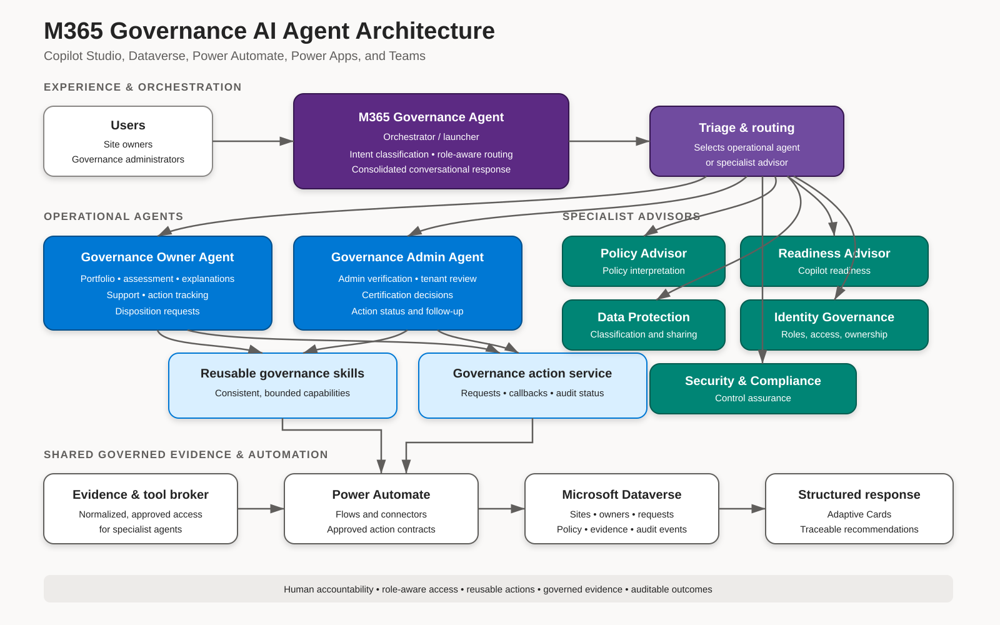
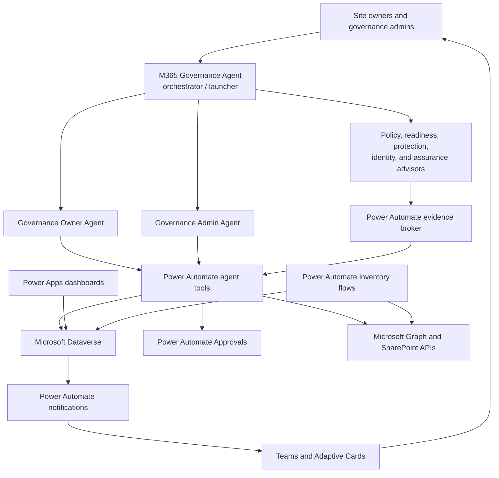

# Agent Orchestration Architecture

This shareable overview is intended for engineering reviewers, hackathon
judges, governance stakeholders, and contributors.

## Architecture at a glance

## Responsibilities

| Agent or service | Primary purpose | Typical outcomes |
|---|---|---|
| M365 Governance Agent | Single entry point, intent classification, and bounded handoff | Consistent discovery and routing |
| Governance Owner Agent | Signed-in owner's governed portfolio | Site views, explanations, support, and disposition requests |
| Governance Admin Agent | Admin-verified tenant operations | Risk review, owner assignment, approvals, and follow-up |
| Specialist advisors | Narrow policy/readiness/protection/identity/assurance analysis | Evidence-based findings and recommendations |
| Power Automate tools | Identity validation and stable transactional contracts | Authorized queries, requests, status, and errors |
| Dataverse | Operational system of record | Sites, owners, policy, requests, events, scans, evidence |
| Power Apps | Delegable operational dashboards | Owner and admin views over the same Dataverse state |

## How orchestration works

1. The user starts in Teams or a published specialist entry agent.
2. Copilot Studio identifies intent and routes to the appropriate agent.
3. Operational agents call bounded Power Automate tools. They do not query SQL,
   SharePoint lists, or unrestricted Dataverse tables directly.
4. The flow uses system-provided caller identity and rechecks owner assignment
   or governance admin membership.
5. Dataverse supplies normalized state; Graph and SharePoint APIs supply live
   Microsoft 365 evidence or execute approved operations.
6. Requests, approvals, state transitions, and notifications are orchestrated
   in Power Automate and recorded in Dataverse.
7. Structured results return through Adaptive Cards or concise conversation.

## Design principles

- **One Power Platform:** Copilot Studio, Dataverse, Power Automate, Power Apps,
  and managed solutions share one ALM and governance model.
- **One system of record:** Dataverse replaces SQL and governance lists.
- **Role-aware separation:** owner self-service and privileged administration
  have distinct tools and authorization.
- **Human accountability:** high-impact changes require explicit confirmation,
  approval, and an event trail.
- **Bounded tools:** agents receive minimized data through stable flow contracts.
- **Safe scale:** paging, delegable queries, alternate keys, and asynchronous
  scan work items avoid client-side inventory scans.

## Hackathon portal summary

**Governor365 is a Power Platform-native, role-aware multi-agent solution for
Microsoft 365 governance. Copilot Studio routes owners and administrators to
focused operational and advisory agents. Dataverse provides the normalized,
auditable system of record; Power Automate provides secure tools, inventory,
approvals, notifications, and reconciliation; Power Apps provides dashboards;
and Teams delivers the conversational experience.**

## Related material

- [Target architecture](02-Architecture.md)
- [Dataverse data model](04-DataModel.md)
- [Power Automate build guide](12-PowerAutomate-Build-Guide.md)
- [Refactor decision and migration](23-Power-Platform-Refactor.md)
- [Hackathon project summary](24-Hackathon-Project-Summary.md)
