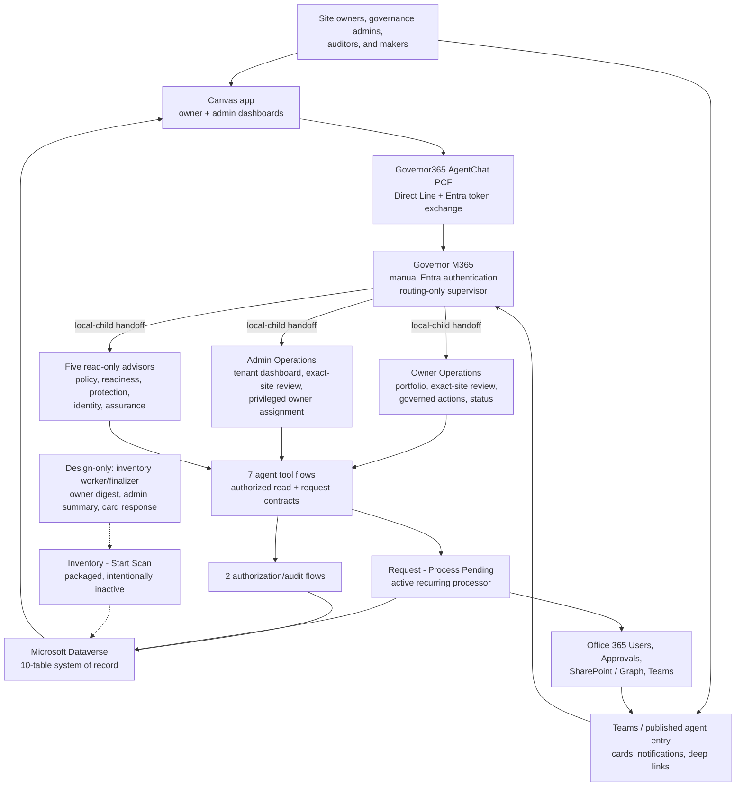

# Agent Orchestration Architecture

This shareable overview is intended for engineering reviewers, hackathon
judges, governance stakeholders, and contributors.

## Architecture at a glance

## Responsibilities

| Agent or service | Primary purpose | Typical outcomes |
|---|---|---|
| Governor M365 | Single manually authenticated entry point, intent classification, and bounded local-child handoff | Consistent discovery and routing without connected-agent authentication mismatch |
| Owner Operations child | Signed-in owner's governed portfolio and exact-site operations | Site views, governed-action requests, explanations, support, and request status |
| Admin Operations child | Admin-verified tenant operations and exact-site operations | Risk review, governed-action requests, privileged owner assignment, and follow-up |
| Five advisor children | Narrow policy/readiness/protection/identity/assurance analysis | Evidence-based findings and recommendations |
| Power Automate tools | Identity validation and stable transactional contracts | Authorized queries, requests, status, immutable events, and fail-closed errors |
| Dataverse | Operational system of record | Sites, owners, policy, requests, events, scans, evidence |
| Power Apps | Required delegable operational dashboard | Owner and admin views, filters, details, requests, and exceptions over the same Dataverse state |
| Agent Chat PCF | Side-by-side Canvas and Copilot Studio experience | Web Chat rendering, versioned UI context, and allowlisted Canvas events over Direct Line |
| Microsoft Teams | Unified experience host | Organizational dashboard tab, agent access, notifications, and bidirectional deep links |

## Agent composition decision

All eight top-level agent records are solution components of the
`M365Governance` (`Governor365 Power Platform`) solution. `M365GovMan` no
longer contains agent components.

Governor M365 uses seven local child agents:

- Owner Operations and Admin Operations own the operational topics and invoke
  the authorization-enforcing Dataverse flows.
- Five advisor children provide bounded, read-only policy, readiness,
  protection, identity, and assurance guidance.
- Governor M365 classifies and delegates; its instructions prohibit executing
  operational or advisory domain work in the parent.
- The seven specialist records remain independently published entry agents for
  future reuse, but Governor M365 does not invoke them as connected agents.

The Canvas PCF channel requires manual Entra authentication. Keeping owner
portfolio, dashboard, and advisory handling in Governor M365 preserves that
signed-in identity. Copilot Studio allows connected Copilot chat agents to
publish only with Integrated authentication. A manual launcher invoking an
Integrated agent fails with `ConnectedAgentAuthMismatch`, while changing the
destination to manual authentication fails publication with
`PublishNotAllowedException`.

Local child agents are the supported composition for this channel because they
share Governor's settings, authentication, conversation, ownership, and
publication lifecycle. Connected agents remain a future option if Copilot
Studio supports the same manual-authentication path end to end.

## Package implementation status

The `M365Governance` solution was migrated and published on September 21, 2026
with the supported child-agent authentication boundary:

- Governor M365 declares zero `InvokeConnectedAgentTaskAction` routes.
- Seven enabled local child agents are visible under Governor M365.
- Owner Operations owns `My Sites`; Admin Operations owns `Admin Dashboard`.
- Those child topics call the Dataverse-backed `List Owner Sites` and
  `List Admin Sites` flows.
- Every destination flow performs authorization again; routing and Canvas
  context are not treated as authorization.
- Legacy SharePoint-based owner-site and admin-check bindings were removed.
  The obsolete SharePoint admin-check flow was also removed from the solution.
- The active launcher topics no longer call either legacy agent flow. The stale
  `GovernanceAgent-GetMySites` topic-to-workflow relationship was removed from
  Dataverse. The final September 21 export reports zero missing dependencies,
  and the active `My Sites` topic calls only the Dataverse-backed
  `List Owner Sites` flow.
- Post-publish verification confirmed zero connected-agent actions and a
  successfully published manual-authentication parent/child topology.
- The canonical build now fails if a missing dependency, stale topic-to-flow
  relationship, or connected-agent route is reintroduced.

The solution package stores each internal flow as a solution component and each
destination topic's `flowId` as the action reference. The child relationship is
stored through each owned topic's `parentbotcomponentid`. After published
Canvas parity tests passed for both operational children, the original root
`My Sites` and `Admin Dashboard` copies were disabled and retained only for
time-bounded rollback.

The current release contains 11 distinct cloud flows. Twenty-two unique
flow-bound agent components create 23 topic-to-flow relationships because the
`OwnerSiteReview` topic invokes both `Get Site Detail` and `Submit Request`.
Those component and relationship counts are references to reusable flows, not
additional Power Automate flows.

The implemented governed-action menu contains Certify, Archive, Deletion
review, Assign owners, and Cancel. The four write choices collect a business
reason and current-turn confirmation before calling the authorization-enforcing
Submit Request flow. Deletion review additionally requires typed `CONFIRM`;
owner assignment collects the target owner's work email and requires a current
GovernanceAdmin role. Cancel performs no write. A successful submission creates
a Governance Action Request and Submitted event; it does not claim that the
underlying Microsoft 365 operation has completed.

`Inventory - Start Scan` is packaged but intentionally inactive until its
worker and finalizer are implemented. Those two flows and the Owner Digest,
Admin Summary, and Card Response flows remain design-only roadmap automation
and are not part of the 11-flow release inventory.

## How orchestration works

1. The user starts in the Canvas app, Teams, or a published agent entry point.
2. Governor M365 classifies the request and delegates it to exactly one local
   child, passing only the minimum relevant conversation context.
3. Operational children call bounded Power Automate tools. They do not query SQL,
   SharePoint lists, or unrestricted Dataverse tables directly.
4. The flow uses system-provided caller identity and rechecks owner assignment
   or governance admin membership.
5. Dataverse supplies normalized state; Graph and SharePoint APIs supply live
   Microsoft 365 evidence or execute approved operations.
6. Requests, approvals, state transitions, and notifications are orchestrated
   in Power Automate and recorded in Dataverse.
7. Structured results return through Adaptive Cards or concise conversation.

## Design principles

- **One Power Platform:** Copilot Studio, Dataverse, Power Automate, Power Apps,
  and managed solutions share one ALM and governance model.
- **One system of record:** Dataverse replaces SQL and governance lists.
- **Role-aware separation:** owner self-service and privileged administration
  have distinct tools and authorization.
- **Human accountability:** high-impact changes require explicit confirmation,
  approval, and an event trail.
- **Bounded tools:** agents receive minimized data through stable flow contracts.
- **Safe scale:** paging, delegable queries, alternate keys, and asynchronous
  scan work items avoid client-side inventory scans.

## Hackathon portal summary

**Governor365 is a Power Platform-native, role-aware solution for Microsoft
365 governance. Copilot Studio provides authenticated owner, administrator,
and advisory experiences. Dataverse provides the normalized,
auditable system of record; Power Automate provides secure tools, inventory,
approvals, notifications, and reconciliation; Power Apps provides dashboards;
and Teams delivers the conversational experience.**

## Related material

- [Target architecture](02-Architecture.md)
- [Dataverse data model](04-DataModel.md)
- [Power Automate build guide](12-PowerAutomate-Build-Guide.md)
- [Refactor decision and migration](23-Power-Platform-Refactor.md)
- [Hackathon project summary](24-Hackathon-Project-Summary.md)
