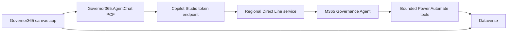

# 28 - PCF Agent Chat Integration

**Status:** SSO-capable Canvas integration deployed; final post-redirect token-exchange smoke test pending  
**Component:** `Governor365.AgentChat`  
**Version:** 0.3.3

## 1. Decision

Governor365 uses a React Power Apps component framework control to place the
Copilot Studio orchestrator beside the canvas dashboard. The control hosts Bot
Framework Web Chat and connects through the Copilot Studio **Mobile app**
channel.

The browser requests a short-lived Direct Line token from the channel token
endpoint. No Direct Line secret is stored in the app, component, source, or
solution. This preserves the Power Platform-first target and does not introduce
an Azure Function or another application data store.

The PCF uses Direct Line HTTP polling instead of WebSockets. The published
Power Apps player can end the embedded WebSocket after conversation creation
even when the same connection works in Studio. Polling preserves the supported
Direct Line protocol while keeping the connection stable in both hosts.



## 2. Component contract

### Inputs

| Property | Type | Purpose |
|---|---|---|
| `tokenEndpoint` | Text | Mobile App channel token endpoint copied from Copilot Studio |
| `ssoClientId` | Text | Application (client) ID of the PCF SPA registration (App B) |
| `ssoTenantId` | Text | Microsoft Entra tenant ID |
| `ssoRedirectUri` | Text | Exact SPA redirect URI registered on App B |
| `ssoLoginHint` | Text | Signed-in user's UPN, used only to select the existing Entra session |
| `contextJson` | Multiline text | Current app context as a JSON object |
| `contextVersion` | Whole number | Incremented whenever the selected app context changes |
| `promptText` | Multiline text | Canvas-initiated natural-language prompt, limited to 4,000 characters |
| `promptVersion` | Whole number | Incremented to send the current prompt exactly once |
| `userId` | Text | Stable Web Chat user identifier; not an authorization claim |
| `userDisplayName` | Text | Display name shown in chat |
| `locale` | Text | Web Chat locale, default `en-US` |
| `title` | Text | Accessible panel heading |

`contextJson` is limited to 16,384 characters and must deserialize to a JSON
object. Never place access tokens, credentials, raw sensitive evidence, or
authorization decisions in it.

The component sends this envelope in the `startConversation` event, in
`governor365.context` events after context changes, and in
`channelData.governor365Context` on every user message:

```json
{
  "schemaVersion": "1.0",
  "source": "Governor365.Canvas",
  "sequence": 4,
  "sentAt": "2026-09-19T12:00:00.000Z",
  "context": {
    "screen": "scrDashboard",
    "persona": "Owner",
    "siteId": "00000000-0000-0000-0000-000000000000",
    "siteName": "M365 Governance"
  }
}
```

The context is a user-experience hint only. Agent tools must continue deriving
identity from `System.User.PrincipalName` and independently authorizing every
read or write.

Canvas-initiated prompts are normal user message activities marked with
`channelData.governor365Source = "canvasCommand"`. The control attaches the
latest `governor365Context` envelope through the same middleware used for typed
messages. This makes a button click a grounded conversational turn without
introducing a second agent protocol or treating Canvas context as authorization.
The prompt is visible in the transcript so the user can see exactly what the
app asked on their behalf.

Record-specific Canvas commands also include the selected Dataverse record ID
in the visible prompt. This is intentional redundancy: Copilot Studio
orchestration can route the request and preserve the exact identifier even when
a generative route cannot inspect custom channel data. The context envelope
remains available to deterministic topics, but it is not the only carrier of a
record identifier needed by a delegated task. The destination tool must still
authorize the caller and retrieve the live record by that ID.

### Outputs and events

| Property/event | Purpose |
|---|---|
| `connectionStatus` | `connecting`, `connected`, or `error` |
| `conversationId` | Direct Line conversation identifier for diagnostics |
| `lastError` | User-safe connection or protocol error |
| `lastActionName` | Latest validated canvas action name |
| `lastActionJson` | Latest validated action envelope |
| `OnConnectionStatusChanged` | Power Fx behavior event |
| `OnAgentAction` | Power Fx behavior event |

An agent-to-canvas action must arrive as a Direct Line event named
`governor365.canvas.action` with this value:

```json
{
  "schemaVersion": "1.0",
  "name": "openSite",
  "correlationId": "optional-correlation-id",
  "payload": {
    "siteId": "00000000-0000-0000-0000-000000000000"
  }
}
```

The component validates the envelope and caps it at 16,384 characters before
raising `OnAgentAction`. The Canvas formula must still allowlist action names
and validate identifiers. Never evaluate agent-provided Power Fx, URLs, or
expressions.

## 3. Build and import

Prerequisites:

- Node.js supported by the current PCF toolchain.
- Microsoft Power Platform CLI.
- .NET SDK capable of building the generated Dataverse solution project.
- The environment setting **Power Apps component framework for canvas apps**
  enabled.

Build:

```powershell
Set-Location .\pcf\Governor365AgentChat
npm install
npm test
npm run lint
npm run build -- --buildMode production

Set-Location ..\..
dotnet build .\pcf\M365GovernanceSolution\M365GovernanceSolution.cdsproj --configuration Release
```

The solution build writes `M365Governance_2_0_0_0.zip`. Import this unmanaged
package in development. It contains the existing Canvas app, bots, bot
components, flows, Dataverse components, environment variables, and
`Governor365.AgentChat` in one solution boundary. Do not deploy the isolated
`Governor365AgentChatSolution` package as part of a Governor365 release.

After tenant validation and Canvas wiring, export the complete
`M365Governance` solution as managed for test and production. This tenant
export is required because the checked-in canonical source is an unmanaged
development export.

The control declares these external service domains and is therefore treated
as a premium component:

- `*.environment.api.powerplatform.com`
- `*.environment.api.powerplatform.us`
- `directline.botframework.com`
- `directline.botframework.azure.us`

Confirm the exact endpoints for the target cloud and permit only the applicable
domains in tenant network and DLP controls.

The integrated unmanaged package was imported and published successfully in
the development environment on 2026-09-19. Version 0.1.2 adds the dark
Teams-oriented visual treatment; version 0.1.1 forced Canvas to invalidate its
cached 0.1.0 bundle after the Direct Line initialization fix.
The manifest intentionally declares only the React 16.14.0 platform library.
Fluent is not used directly by this control, and declaring Fluent 9.68.0
prevented import because manifest versions above 9.46.2 are not accepted by the
target platform.

## 4. Copilot Studio setup

1. Open **Governor M365**.
2. Configure **Authenticate manually** using **Microsoft Entra ID V2 with
   client secrets**, App A client ID, the existing App A client secret, and
   scopes `profile openid`. Keep **Require users to sign in** enabled.
3. Set **Token exchange URL (required for SSO)** to
   `api://5ed8c4be-0464-434a-b2b6-55bc6953ce3b/access_as_user`.
4. Save and publish the agent.
5. Open **Channels > Mobile app** and copy the token endpoint.
6. Store the endpoint as deployment configuration. Do not store a Direct Line
   secret.
7. In the Conversation Start topic, read the value from
   `System.Activity.Value` and retain only the approved context fields.
8. Add an event-activity topic for `governor365.context` so a selection change
   refreshes the conversation-scoped context.
9. When a deterministic topic needs record context, prefer the context attached
   to the current message under
   `System.Activity.ChannelData.governor365Context`, validate its schema and
   identifier, then pass only the stable record ID to a bounded tool.

The exact event-topic authoring surface can differ by Copilot Studio release.
Create and validate these two topics in the graphical authoring experience
before exporting their generated YAML; do not hand-author an unvalidated
trigger schema.

### Development authentication

The `Governor M365` agent is configured with **Authenticate manually** using
Microsoft Entra ID, with authentication required **Always**. The solution
export includes the associated authentication connection. Preserve these
settings when merging or repacking the solution; reverting to **Authenticate
with Microsoft** causes Direct Line/Web Chat to return
`IntegratedAuthenticationNotSupportedInChannel`.

Copilot Studio currently allows connected Copilot chat agents to publish only
with Integrated authentication. Because `Governor M365` requires manual Entra
authentication for the embedded PCF channel, it must not contain
`InvokeConnectedAgentTaskAction` components. Mixing the manual launcher with
Integrated connected agents fails at runtime with `ConnectedAgentAuthMismatch`;
changing connected agents to manual authentication makes their publication
fail with `PublishNotAllowedException`. Run
`scripts/Test-ConnectedAgentAuthentication.ps1` after merging agent changes or
exporting from Copilot Studio. The canonical solution build runs this check
automatically and fails before packaging if a connected route is reintroduced.
The build also runs `scripts/Test-SolutionPackageIntegrity.ps1` and fails when
the export declares a missing dependency or retains a stale topic-to-flow
relationship.

SSO uses two separate, single-tenant registrations:

- **App A - Copilot Agent Authentication**
  (`5ed8c4be-0464-434a-b2b6-55bc6953ce3b`) remains the confidential
  authentication application used by Copilot Studio. It exposes
  `access_as_user`, preauthorizes App B for that scope, and uses
  `https://token.botframework.com/.auth/web/redirect`.
- **App B - Copilot Agent Authentication - PCF**
  (`f104fe0a-6b8a-446b-a623-cfbd7c7e2b11`) is the public SPA client. It has
  delegated access to App A's `access_as_user` scope and tenant-wide consent.
  Its SPA registration contains both the environment-specific outer Canvas
  player URI and `https://runtime-app.powerplatform.com/`. MSAL uses the latter
  because it is same-origin with the iframe that hosts Canvas PCF controls.
  The redirect URI is an exact match, including the trailing slash.

The **Access tokens** and **ID tokens** switches under implicit grant are not
required by this implementation: App B uses authorization code with PKCE, and
App A is a confidential web client. App A's secret stays only in the Copilot
Studio connection. The PCF contains no secret: it silently acquires an App A
scoped token through App B, intercepts the OAuth card, and sends the standard
`signin/tokenExchange` invoke activity. If the signed-in Power Apps session
can't be reused, version 0.3.3 keeps the OAuth card visible and intercepts its
Login action to open an MSAL authorization-code-with-PKCE popup. It then posts
the resulting token through the same `signin/tokenExchange` activity rather
than using a validation code. The orchestrator's **Sign in** system topic must
not send a separate sign-in message before `OAuthInput`; otherwise users see
that message even when SSO succeeds and see both the message and login card
when SSO fails.

Do not weaken the agent to anonymous access or bypass the tenant control.
Publish the agent after changing authentication, then verify that the OAuth
card contains `tokenExchangeResource` and that the PCF-hosted conversation
continues without a validation code.

## 5. Canvas app wiring

After importing the control, enable code components for the app and insert
**Governor365 Agent Chat** on the owner and administrator screens.

Initialize the context counter:

```powerfx
Set(varChatContextVersion, 1)
```

Whenever a gallery selection or screen context changes:

```powerfx
Set(varSelectedSite, ThisItem);
Set(varChatContextVersion, varChatContextVersion + 1)
```

Set the component properties:

```powerfx
// tokenEndpoint
varCopilotMobileTokenEndpoint

// ssoClientId
"f104fe0a-6b8a-446b-a623-cfbd7c7e2b11"

// ssoTenantId
"8221c52a-2c7f-4da0-8b1f-34c6f692d915"

// ssoRedirectUri
"https://runtime-app.powerplatform.com/"

// ssoLoginHint
User().Email

// contextJson
JSON(
    {
        screen: App.ActiveScreen.Name,
        persona: If(varIsAdmin, "Administrator", "Owner"),
        siteId: If(IsBlank(varSelectedSite), Blank(), Text(varSelectedSite.'Governance Site')),
        siteName: If(IsBlank(varSelectedSite), Blank(), varSelectedSite.Name)
    },
    JSONFormat.Compact
)

// contextVersion
varChatContextVersion

// promptText
varChatPromptText

// promptVersion
varChatPromptVersion

// userId
Text(User().EntraObjectId)

// userDisplayName
User().FullName

// locale
"en-US"
```

Initialize prompt state in `App.OnStart`:

```powerfx
Set(varChatPromptVersion, 0);
Set(varChatPromptText, "")
```

To turn a Canvas interaction into an agent turn, set the prompt and then
increment its version:

```powerfx
Set(
    varChatPromptText,
    "Assess the site I selected. Use its ID from the canvas context and live data. Do not make changes."
);
Set(varChatPromptVersion, Coalesce(varChatPromptVersion, 0) + 1)
```

Governor365 implements three initial integrated scenarios:

1. **Proactive portfolio briefing** - once per app session and persona, the
   visible chat asks for a live, prioritized owner or administrator briefing.
2. **Assess selected site** - the site action button sends a grounded
   read-only assessment prompt for the selected site ID.
3. **Take governed action** - the action button asks the agent to explain the
   safest workflow, impact, approvals, and accountable role. A write is allowed
   only after explicit confirmation in chat and independent tool authorization.

Dashboard filter clicks also increment `contextVersion`, and `activeFilter` is
included in `contextJson`, so subsequent typed or Canvas-initiated turns remain
aware of the user's current triage view.

The development app currently binds the verified, non-secret Mobile App token
endpoint directly because Canvas runtime reads of the `Environment Variable
Definitions` and `Environment Variable Values` system tables returned
`Error: Network`. The solution still carries
`sb_CopilotMobileTokenEndpoint` as deployment configuration. Before promoting
to another environment, replace the development endpoint during deployment or
introduce a supported configuration API/flow; do not assume those system
tables can be read from Canvas at runtime. Direct Line tokens remain
short-lived and must never be stored.

Use a strict `OnAgentAction` formula:

```powerfx
With(
    { action: ParseJSON(AgentChat1.lastActionJson) },
    Switch(
        Text(action.name),
        "openSite",
            With(
                { requestedSiteId: GUID(Text(action.payload.siteId)) },
                Set(
                    varSelectedSite,
                    LookUp('Governance Sites', 'Governance Site' = requestedSiteId)
                );
                If(
                    IsBlank(varSelectedSite),
                    Notify("The requested site is not available.", NotificationType.Error),
                    Navigate(scrDashboard)
                )
            ),
        "refreshSites",
            Refresh('Governance Sites'),
        Notify("The agent requested an unsupported app action.", NotificationType.Warning)
    )
)
```

This lookup remains constrained by Dataverse row security. Do not add navigation
actions that bypass row access or call privileged operations directly.

For `OnConnectionStatusChanged`, surface `lastError` only when status is
`error`; log `conversationId` with the existing telemetry/correlation pattern.

## 6. Agent-to-canvas actions

Initial production scope should allow only:

- `openSite` - select an already accessible Governance Site and navigate to its
  detail screen.
- `refreshSites` - refresh the existing secured Dataverse data source.
- `openRequest` - select an already accessible Governance Action Request after
  validating its GUID and retrieving it through the user's existing row access.

Writes, approvals, role changes, and destructive operations remain agent tool
or governed Canvas-flow operations. They are never implemented as local PCF
actions.

## 7. Security and operational controls

- Require authenticated agent use; do not use **No authentication**.
- Treat `userId`, display name, and canvas context as untrusted presentation
  data. They are not authorization inputs.
- Keep privileged flow authorization fail-closed and based on the authenticated
  Copilot Studio identity.
- Do not log token responses, OAuth tokens, or complete sensitive context.
- Keep context small and use stable GUIDs instead of complete Dataverse rows.
- Apply Content Security Policy, DLP, environment, and cloud-specific endpoint
  review before production.
- Review `npm audit` findings for each release. Patched `sanitize-html`,
  `valibot`, and `uuid` versions are pinned through npm overrides. The current
  production dependency audit reports zero vulnerabilities; the PCF
  development toolchain still reports six moderate advisories and should be
  updated when compatible Microsoft build packages are available.
- Web Chat is intentionally bundled locally; the control does not load scripts
  from a public CDN.
- Keep Canvas-generated prompts explicit, visible, and bounded. They must never
  contain instructions to bypass confirmation, authorization, or tool policy.

## 8. Acceptance tests

1. An authenticated owner opens the app and the control reaches `connected`.
2. The welcome turn is generated once and includes no credentials or hidden
   tenant data.
3. Opening either persona screen sends only the standard conversation-start
   greeting. A dashboard or portfolio listing is sent only when the user asks
   for it.
4. Selecting another site increments `contextVersion` and the next request for
   “this site” resolves the new site.
5. Clicking **Assess selected site** or **Review selected site** sends one
   visible prompt containing the selected record ID. Owner Operations extracts
   the ID without another question and returns only the authorized live
   evidence, risk, policy comparison, and prioritized remediation for that
   exact site.
6. Clicking the governed-action button explains impact and approvals before
   any tool asks for explicit confirmation.
7. A user cannot retrieve or open a site outside Dataverse row access.
8. An administrator receives the same role result through chat and the
   dashboard; the tool independently revalidates authorization.
9. A valid `openSite` event navigates to an accessible site.
10. An unknown action, malformed JSON, oversized context or prompt, and invalid GUID all
   fail visibly without executing an operation.
11. Expired Direct Line tokens, blocked endpoints, and agent publication errors
   produce `connectionStatus = \"error\"` and a useful `lastError`.
12. Keyboard-only use, screen-reader labeling, zoom, and high-contrast behavior
   pass App Checker and manual accessibility review.
13. The managed solution installs in test with no missing dependencies and the
    published app reconnects to the test environment's token endpoint.

## 9. Development validation result

Validated in Power Apps Studio on 2026-09-19:

- The app has no formula errors.
- `AgentChatOwner` and `AgentChatAdmin` both render in the three-column layout.
- Both controls obtain a short-lived token and report
  `Connectivity Status: Connected`.
- Version 0.1.1 no longer passes the token response's `conversationId` into the
  Direct Line constructor. The invalid reconnect request and its 404 response
  are gone.
- The deprecated `hideUploadButton` warning is gone.
- A full agent turn remains blocked by
  `IntegratedAuthenticationNotSupportedInChannel`; complete the manual Entra
  ID authentication work above before running acceptance tests 2 through 7.

Version 0.2.0 adds the bounded Canvas prompt contract and the proactive,
selection-aware scenarios above. Unit tests, lint, and the production PCF build
pass locally. Import the rebuilt solution and repeat the tenant acceptance tests
because Power Apps Studio and Copilot Studio runtime validation require the
target environment.

Version 0.2.1 preserves the underlying Web Chat rejection message in
`lastError` instead of replacing every connection failure with the generic
“Direct Line rejected the connection” text. This makes browser-, policy-, and
transport-specific failures actionable while retaining a safe fallback.

Version 0.2.2 uses Web Chat's named React export and guards component
initialization. This prevents an undefined component export from surfacing as
Power Apps' generic **Error loading control** placeholder.

Version 0.2.3 uses Direct Line HTTP polling and reports terminal Direct Line
connection states. It also treats an uninitialized one-time briefing flag as
`false`, so the proactive briefing is not skipped when screen `OnVisible`
executes before `App.OnStart` finishes.

Version 0.2.4 completes each Web Chat Redux action before invoking Power Apps
output and behavior-event callbacks. This prevents a Canvas rerender from
disposing Direct Line while `CONNECT_FULFILLED` is still posting the initial
conversation activity.

Version 0.2.5 keeps Direct Line ownership in the PCF control instance rather
than the transient React effect. Power Apps can dispose that effect during a
published-player rerender; the conversation now ends only when the PCF control
is destroyed or deliberately replaces the connection.

Version 0.2.6 also carries the versioned Canvas command inside the established
context JSON contract. This provides a compatible fallback for published
players that do not reevaluate newly added standalone PCF input properties.

Version 0.2.7 invokes the Canvas connection-status behavior event only for
errors. Routine `connecting` and `connected` transitions remain available from
the control state without forcing the published player to recycle the PCF while
its initial Direct Line activities are in flight.

Version 0.2.8 does not terminate Direct Line from the PCF `destroy` callback.
The published player invokes that callback during initial composition while
retaining the rendered control, so ending the client there aborts conversation
creation. Browser page teardown remains the transport lifetime boundary.

Version 0.2.9 sends the one-time conversation-start event and initial Canvas
prompt when Direct Line reports `Online`. This avoids a startup race where the
client can connect before Web Chat subscribes and therefore never emits
`CONNECT_FULFILLED` through the configured Redux middleware.

Version 0.2.10 queues the latest versioned Canvas prompt until Web Chat's
posting pipeline is ready after the Direct Line `Online` transition. This
prevents a successful connection and start event from racing ahead of the
visible proactive prompt.

Version 0.2.11 posts Canvas-generated prompts through the active Direct Line
client with a unique client activity ID and the current governance context.
This avoids the published player's delayed Web Chat Redux posting pipeline;
the normal Direct Line echo still renders the user's prompt in the transcript.

Version 0.2.12 sends the initial proactive prompt only after Direct Line
acknowledges the conversation-start event. Context changes and later button
commands remain immediate, while first-load orchestration is deterministic.

Version 0.2.13 keeps a page-lifetime subscription to Direct Line activities
and forwards them into the Web Chat store. The published player can recycle
Web Chat's own subscription during composition; the PCF-owned subscription
keeps HTTP polling active and prevents Copilot responses from being lost.

Version 0.2.14 uses the user identity embedded in the short-lived Direct Line
token for all directly posted activities. This matches Web Chat's identity
behavior and prevents Copilot Studio from ignoring otherwise accepted Canvas
messages whose sender does not match the token.

Version 0.2.15 deduplicates incoming activities by Direct Line activity ID.
This allows the PCF-owned polling subscription to remain as a published-player
lifecycle safeguard without rendering bot messages twice while Web Chat's own
subscription is also active.

Version 0.2.16 sends one bot-facing activity per Canvas intent. The full
governance context remains attached to every prompt and typed message, while
context-only UI changes update the local envelope without producing an
additional Copilot turn. At startup, a proactive prompt replaces the separate
conversation-start event. This prevents duplicate authentication cards and
duplicate bot turns.

Published-player validation for 0.2.16 completed on 2026-09-20:

- Published app version and draft version:
  `2026-09-20T19:52:50Z`.
- Publish time: `2026-09-20T19:53:43.5015837Z`.
- Local and deployed bundle SHA-256:
  `FC89F5AE8084BF7DA1D83BC4BE42C93778929953FB05BFD9221F0202562FEE4E`.
- The control remained connected, with no terminal Direct Line status or send
  failure, while repeated HTTP polling requests returned 200.
- The initial Canvas prompt appeared once and produced one Copilot
  authentication message and one login card.
- **Review selected site** appeared in the published player and produced one
  grounded prompt through one successful Direct Line POST.
- **Start governed action** appeared in the published player and produced one
  governed-action prompt through one successful Direct Line POST.

Version 0.3.3 runtime and release validation completed on 2026-09-21:

- Silent SSO requests the App A `access_as_user` scope through App B.
- When the Canvas iframe cannot complete silent SSO, the OAuth Login action
  opens the MSAL popup instead of falling back to a validation code.
- The popup initially returned `AADSTS50011`; the missing exact SPA redirect
  URI `https://runtime-app.powerplatform.com/` was then added to App B and
  verified through both Entra and Azure CLI. A session-authenticated
  authorization-code probe returned to that URI with a code, the expected
  state, and no AADSTS error.
- The final live unmanaged export has zero missing dependencies and zero active
  connected-agent routes. All 19 flow-bound components pass the package
  integrity guard.
- PCF protocol and authentication tests: 12 passed. Lint and the optimized PCF
  build passed. The complete solution build passed with zero MSBuild warnings
  or errors; only the existing Webpack bundle-size recommendations remain.

Selected-site routing validation completed on 2026-09-21:

- Canvas startup no longer auto-submits an owner portfolio or administrator
  dashboard request.
- Canvas context remains passive; button commands use the dedicated
  `promptText`/`promptVersion` contract and include only the selected site ID.
- Both owner and administrator screens route an exact-site review to Owner
  Operations.
- Owner Operations extracts the GUID from the visible message, calls the
  authorization-enforcing `Get Site Detail` flow, and does not invoke a list
  operation.
- Live validation returned the exact record
  `c409b1c0-a8b2-f111-aaac-000d3a367627` (`CSP`) with evidence, high-priority
  risk, the stored `AssignOwners` policy recommendation, and prioritized
  remediation. No site-ID follow-up question or admin dashboard card was
  produced.
- **Start governed action** passes the selected GUID through the same visible
  prompt contract and the authorized exact-site topic renders closed-list
  buttons for Certify, Archive, Deletion review, Assign owners, and Cancel.
- Each action reuses the exact-site read only for display context. The
  authorization-enforcing Submit Request tool independently resolves the
  signed-in caller and reauthorizes the requested operation before writing.
- Certify, Archive, and Deletion review collect a business reason or evidence.
  Assign owners also collects the target owner's work email and is restricted
  to GovernanceAdmin callers. Deletion review requires typed `CONFIRM`; the
  other operations use an explicit submit/cancel choice.
- A successful response means a Governance Action Request and Submitted audit
  event were recorded in Dataverse. It does not mean the downstream Microsoft
  365 action completed. Certification is processed by the existing scheduled
  processor; archive, deletion review, and owner assignment remain fail-closed
  when approval or execution connectors are unavailable.
- Repeat one Login click after the Entra correction and confirm that
  `signin/tokenExchange` removes the card and completes the proactive admin
  briefing before promoting a managed package.
