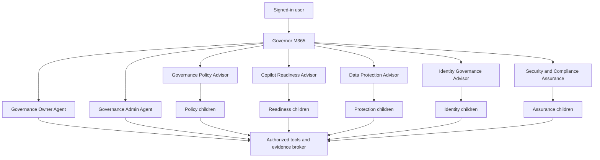

# M365 Governor Agent Catalog

## Runtime model

Governor M365 is the single front door. It performs one direct handoff to a
connected agent and does not read tenant data or synthesize privileged results.
The destination agent owns the response and may invoke only its own children,
topics, prompts, and tools.

## Connected agents

| Agent | Status | What it does | What it does not do |
| --- | --- | --- | --- |
| Governor M365 | Implemented launcher | Greets, classifies intent, clarifies once when needed, and hands off to one agent | Read governance data, authorize users, run assessments, or perform writes |
| Governance Owner Agent | Implemented classic package; skills migration defined | Shows caller-owned SharePoint sites and submits archival, deletion-review, and support requests | Expose tenant-wide data, certify sites, or delete sites directly |
| Governance Admin Agent | Implemented classic package; skills migration defined | Reviews tenant-wide governance posture and submits owner assignment, certification, and disposition actions after role verification | Trust routing as authorization or delete sites directly |
| [Governance Policy Advisor](../new-agents/governance-policy-advisor.md) | Authoring definition ready; not deployed or tool-bound | Assesses maturity and policy gaps, advises on operating models, and drafts governance artifacts | Publish policy, approve policy, enforce controls, or read raw security evidence |
| [Copilot Readiness Advisor](../new-agents/copilot-readiness-advisor.md) | Authoring definition ready; not deployed or tool-bound | Assesses GCC prerequisites and capability claims and creates phased rollout plans | Configure the tenant, purchase licenses, or grant an authorization to operate |
| [Data Protection Advisor](../new-agents/data-protection-advisor.md) | Authoring definition ready; not deployed or tool-bound | Explains exposure, sharing, label, DLP, retention, and data-risk findings | Export sensitive content or change sharing, labels, DLP, or retention |
| [Identity Governance Advisor](../new-agents/identity-governance-advisor.md) | Authoring definition ready; not deployed or tool-bound | Reviews RBAC, PIM, access reviews, RACI, least privilege, and separation of duties | Assign, revoke, activate, or approve roles |
| [Security & Compliance Assurance](../new-agents/security-compliance-assurance.md) | Authoring definition ready; not deployed or tool-bound | Maps findings to controls, evaluates evidence sufficiency, and prepares remediation proposals | Declare compliance, accept risk, close audit findings, or change controls |

## Internal domain components

These components are children only when they need distinct instructions or
knowledge while sharing the parent domain's security and release boundary.
Otherwise they are implemented as a topic, prompt, or tool.

| Parent agent | Internal component | Form | Responsibility |
| --- | --- | --- | --- |
| Governance Policy Advisor | Maturity Assessor | Child agent | Conduct approved maturity interviews and interpret deterministic scores |
| Governance Policy Advisor | Policy Gap Analyst | Child agent | Compare approved policy, control obligations, and aggregate findings |
| Governance Policy Advisor | Draft Artifact Composer | Prompt or topic | Draft policy, standard, RACI, roadmap, or executive artifacts |
| Copilot Readiness Advisor | Readiness Baseline Assessor | Child agent | Evaluate technical and governance prerequisites |
| Copilot Readiness Advisor | GCC Capability Verifier | Child or tool-led topic | Retrieve cloud-specific, source-dated feature claims |
| Copilot Readiness Advisor | Rollout Planner | Prompt or topic | Turn approved readiness gaps into a phased plan |
| Copilot Readiness Advisor | Change Impact Reviewer | Child or topic | Evaluate relevant service changes after rollout |
| Data Protection Advisor | Exposure Analyst | Child agent | Explain current sharing, guest, permission, and exposure findings |
| Data Protection Advisor | Protection Coverage Analyst | Child agent | Interpret label, DLP, retention, and policy coverage |
| Data Protection Advisor | Portfolio Prioritizer | Tool-led topic | Filter and rank backend-scored findings |
| Identity Governance Advisor | Privilege Review Analyst | Child agent | Interpret role assignment, PIM, and access-review evidence |
| Identity Governance Advisor | RACI and SoD Advisor | Child agent | Apply approved accountability and separation-of-duty rules |
| Identity Governance Advisor | Identity Portfolio | Tool-led topic | List backend-calculated stale, excessive, or conflicting assignments |
| Security & Compliance Assurance | Control Mapper | Child agent | Map normalized findings and evidence to applicable controls |
| Security & Compliance Assurance | Evidence Sufficiency Reviewer | Child agent | Evaluate evidence completeness, currency, ownership, and lineage |
| Security & Compliance Assurance | Remediation Package Planner | Prompt or topic | Produce prioritized proposals with owners, approvals, and closure evidence |

## Routing rules

- The launcher chooses exactly one destination agent.
- The destination agent is the only user-facing responder for the turn.
- A domain agent never invokes a peer domain agent.
- Cross-domain work reads authorized normalized findings from the evidence
  broker.
- Child agents cannot invoke connected agents.
- Authorization is enforced by tools and source systems, not by routing text.

Detailed evidence and connector contracts are defined in
[Advisor Agent Integration Architecture](08-Advisor-Agent-Integration-Architecture.md).