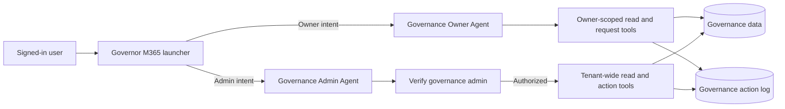

# M365 Governance Agent Architecture

## Purpose

The solution separates discovery and routing from privileged governance work. The launcher identifies intent and invokes a dedicated agent; it does not query governance data or perform governance actions itself.

## Agent responsibilities

### Governor M365 launcher

The deployed display name is **Governor M365**. Its source package remains `agents/M365 Governance Agent` and its schema name is `copilots_header_04c70`.

- Greet the signed-in user and offer Owner, Admin, or Help routes.
- Classify clear owner and admin intents.
- Ask one clarification question when the target is ambiguous.
- Invoke `copilots_gov_owner_01` or `copilots_gov_admin_01` through connected-agent task actions.
- Pass conversation history and signed-in identity context to the selected agent.
- Never query inventory, execute governance logic, or perform writes.

The launcher has web browsing, code interpreter, and file analysis disabled. It uses integrated authentication, group-membership access control, high content moderation, and the Teams and Microsoft 365 Copilot channels.

### Governance Owner Agent

- Show only sites owned by the signed-in caller.
- Read a fresh site record before submitting a request.
- Submit archival, deletion-review, and support requests after explicit current-turn confirmation.
- Report requests as pending until the responsible team completes them.
- Never expose another owner's records or tenant-wide data.
- Never directly delete a site.
- Do not perform owner certification or attestation.

The skills-based target definition is `new-agents/governance-owner-agent.md`. The classic exported package remains under `agents/Governance Owner Agent` during migration.

### Governance Admin Agent

- Verify Governance Admin membership before every tenant-wide read or admin write path.
- Fail closed when verification is unavailable or unsuccessful.
- Review dashboards, noncompliant sites, orphaned sites, attestation status, and site details.
- Assign owners and submit governed disposition actions after a fresh read and explicit confirmation.
- Never directly delete a site.

The skills-based target definition is `new-agents/governance-admin-agent.md`. The classic exported package remains under `agents/Governance Admin Agent` during migration.

## Security invariants

1. Identity comes from the signed-in session, never from a user-supplied UPN.
2. Connected-agent routing is not authorization.
3. Owner authorization and admin membership are enforced by live tools or workflows.
4. Every write requires a fresh record read and explicit confirmation in the current turn.
5. Destructive operations are governed requests, not direct site deletion.
6. Tool failures deny privileged processing; agents must not invent fallback data.
7. Successful completion is reported only when the invoked tool returns success.
8. Every accepted write request is recorded in the governance action log.

## Source model

| Surface | Role |
| --- | --- |
| `agents/*/*.mcs.yml` | Deployable Copilot Studio source of record |
| `agents/*/agents/*.mcs.yml` | Connected-agent declarations generated by Copilot Studio |
| `agents/*/topics/*.mcs.yml` | Deterministic routing and conversation topics |
| `agents/*/workflows` | Workflows embedded in that agent package |
| `skills/*/SKILL.md` | Reusable procedures for the skills-based agent experience |
| `new-agents/*.md` | Target instructions and skill assignments during migration |
| `flows/*.txt` | Flow contracts and implementation notes, not deployable packages |

The deployable export and the target design are intentionally both retained while the skills-based migration is incomplete. Differences between them must be recorded as migration debt, not silently reconciled.

## Change workflow

1. Create a feature branch.
2. Pull the current Copilot Studio package with PAC.
3. Review generated changes, especially `agents`, `topics`, `settings`, workflows, and connection references.
4. Update this architecture document when responsibilities or security invariants change.
5. Validate YAML/JSON and run focused routing scenarios.
6. Commit and push source before publishing to Copilot Studio.
7. Publish, pull again, and commit server-generated metadata.

The dated comparison in `docs/live-baseline-2026-09-14.md` is the initial operational baseline for this workflow.