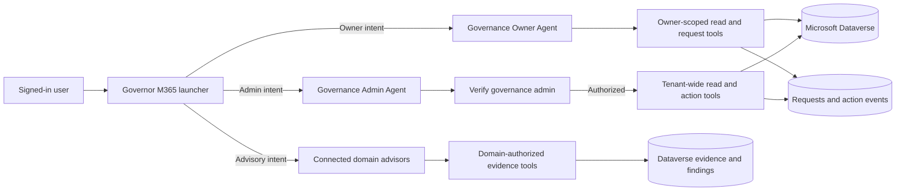

# M365 Governance Agent Architecture

> **Power Platform target (2026-09-17):** Governance data is stored in
> Dataverse and all agent tools, evidence brokering, requests, approvals, and
> notifications run through solution-aware Power Automate flows.

## Purpose

The solution separates discovery and routing from privileged governance work. The launcher identifies intent and invokes a dedicated agent; it does not query governance data or perform governance actions itself.

## Agent responsibilities

### Governor M365 launcher

The deployed display name is **Governor M365**. Its source package remains `agents/M365 Governance Agent` and its schema name is `copilots_header_04c70`.

- Greet the signed-in user and offer Owner, Admin, or Help routes.
- Classify clear owner and admin intents.
- Ask one clarification question when the target is ambiguous.
- Invoke `copilots_gov_owner_01` or `copilots_gov_admin_01` through connected-agent task actions.
- Pass only the conversation and signed-in identity context required by the destination agent.
- Never query inventory, execute governance logic, or perform writes.

The launcher has web browsing, code interpreter, and file analysis disabled. It uses integrated authentication, group-membership access control, high content moderation, and the Teams and Microsoft 365 Copilot channels.

### Connected domain advisors

The domain layer adds Data Protection, Copilot Readiness, Identity Governance,
Governance Policy, and Security & Compliance Assurance as connected agents with
distinct audiences, source access, and release lifecycles.

- Reuse source-agent instructions and business methods for reasoning.
- Obtain tenant facts only through domain-authorized, versioned tools.
- Use direct adapters for fresh scoped checks and scheduled collectors for
  inventory, correlation, baselines, and trends.
- Share normalized finding or assessment identifiers across domains, not raw
  privileged evidence or conversation history.
- Keep recommendations advisory until a separately authorized, confirmed, and
  audited workflow acts.

The [agent catalog](agent-catalog.md) defines every connected agent and internal
child. The [persona model](personas.md) defines audience and response behavior.
The detailed evidence design is in
[Advisor Agent Integration Architecture](08-Advisor-Agent-Integration-Architecture.md),
and delivery details are in the [implementation guide](implementation.md) and
[implementation roadmap](09-Advisor-Implementation-Roadmap.md).

The target runtime uses no more than two generative orchestration levels:

1. the launcher performs one direct connected-agent handoff;
2. the destination domain agent orchestrates only its own children, topics,
   knowledge, and tools.

Owner and Admin are connected agents rather than child agents because they are
independently published operational bots with their own topics, tools, and
security boundaries. A Copilot Studio child agent lives inside its parent and
shares the parent's deployment; deterministic child workflows can require
AdaptiveDialog topics in that parent. Using child agents here would therefore
conflict with the requirement that Governor M365 contain no operational topics
or flow calls. Child agents remain appropriate only within a destination
domain.

Domain agents do not call peer domain agents. Cross-domain assessments read
authorized normalized findings through the evidence broker.

## Subagent map

| Subagent | Primary responsibility | Runtime boundary |
| --- | --- | --- |
| Governance Owner Agent | Owner-scoped site review and governed requests | Connected agent; caller-owned records only |
| Governance Admin Agent | Tenant-wide site governance and governed admin actions | Connected agent; live admin verification required |
| Governance Policy Advisor | Maturity, policy gaps, operating model, and draft artifacts | Connected agent; approved policy-authoring audience |
| Copilot Readiness Advisor | GCC readiness, prerequisites, capability claims, and rollout planning | Connected agent; readiness audience and current capability evidence |
| Data Protection Advisor | Exposure, sharing, classification, DLP, retention, and data-risk findings | Connected agent; isolated protection evidence access |
| Identity Governance Advisor | RBAC, PIM, access reviews, RACI, least privilege, and separation of duties | Connected agent; restricted identity evidence access |
| Security & Compliance Assurance | Control mapping, evidence sufficiency, audit readiness, and remediation proposals | Connected agent; ISSO/security audience |

Each domain advisor may delegate only to its own child agents, topics, prompts,
and tools. See the [agent catalog](agent-catalog.md) for those internal
components and exclusions.

### Governance Owner Agent

- Show only sites owned by the signed-in caller.
- Read a fresh site record before submitting a request.
- Submit certification, archival, deletion-review, and support requests after
  the required fresh read and explicit current-turn confirmation.
- Report requests as pending until the responsible team completes them.
- Never expose another owner's records or tenant-wide data.
- Never directly delete a site.
- Treat certification as a governed request recorded in Dataverse; it is not a
  compliance approval or direct source-system write by the agent.

The skills-based target definition is `new-agents/governance-owner-agent.md`. The classic exported package remains under `agents/Governance Owner Agent` during migration.

### Governance Admin Agent

- Verify Governance Admin membership before every tenant-wide read or admin write path.
- Fail closed when verification is unavailable or unsuccessful.
- Review dashboards, noncompliant sites, orphaned sites, attestation status, and site details.
- Assign owners and submit governed disposition actions after a fresh read and explicit confirmation.
- Never directly delete a site.

The skills-based target definition is `new-agents/governance-admin-agent.md`. The classic exported package remains under `agents/Governance Admin Agent` during migration.

## Security invariants

1. Identity comes from the signed-in session, never from a user-supplied UPN.
2. Connected-agent routing is not authorization.
3. Owner authorization and admin membership are enforced by live tools or workflows.
4. Every write requires a fresh record read and explicit confirmation in the current turn.
5. Destructive operations are governed requests, not direct site deletion.
6. Tool failures deny privileged processing; agents must not invent fallback data.
7. Successful completion is reported only when the invoked tool returns success.
8. Every accepted write request and state transition is recorded in Dataverse
   Governance Action Request and Governance Action Event.
9. Agent instructions and static knowledge are not evidence of current tenant state.
10. Cross-domain access uses normalized, audience-trimmed findings rather than raw source records.
11. A normal user turn has one intended response owner and no peer-agent fan-out.
12. Runtime orchestration does not exceed launcher, domain, and domain-child/tool depth.

## Source model

| Surface | Role |
| --- | --- |
| `agents/*/*.mcs.yml` | Deployable Copilot Studio source of record |
| `agents/*/agents/*.mcs.yml` | Connected-agent declarations generated by Copilot Studio |
| `agents/*/topics/*.mcs.yml` | Deterministic routing and conversation topics |
| `agents/*/workflows` | Workflows embedded in that agent package |
| `skills/*/SKILL.md` | Reusable procedures for the skills-based agent experience |
| `new-agents/*.md` | Target instructions and skill assignments during migration |
| `flows/*.txt` | Flow contracts and implementation notes, not deployable packages |

The deployable export and the target design are intentionally both retained while the skills-based migration is incomplete. Differences between them must be recorded as migration debt, not silently reconciled.

## Change workflow

1. Create a feature branch.
2. Pull the current Copilot Studio package with PAC.
3. Review generated changes, especially `agents`, `topics`, `settings`, workflows, and connection references.
4. Update this architecture document when responsibilities or security invariants change.
5. Validate YAML/JSON and run focused routing scenarios.
6. Commit and push source before publishing to Copilot Studio.
7. Publish, pull again, and commit server-generated metadata.

The latest operational comparison is recorded in
[Live Agent Reconciliation - 2026-09-16](live-baseline-2026-09-16.md).