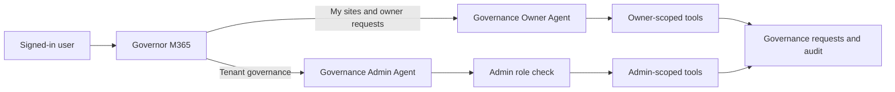

# Hackathon Team Review Packet

**Project:** M365 Governance AI Agent

**Review snapshot:** 2026-09-14

**Audience:** Hackathon team members, reviewers, makers, and testers

## Review goal

Use this packet to understand the design quickly, test the assumptions that matter, and agree on the smallest credible hackathon demonstration. This is a review document, not a claim that every described capability is production-ready.

By the end of the review, the team should agree on:

1. The launcher, Owner Agent, and Admin Agent responsibility boundaries.
2. The identity and authorization model.
3. The workflows that must work in the hackathon demo.
4. The known gaps that will be fixed, deferred, or demonstrated as future work.
5. Who owns each next action.

## Problem statement

Microsoft 365 governance teams need a safer way to help site owners and administrators understand SharePoint governance status and submit remediation requests. The experience must make common tasks conversational without allowing prompt text to bypass identity, authorization, confirmation, or audit controls.

The solution uses three Copilot Studio agents:

- **Governor M365** is the front door. It recognizes owner or admin intent and routes the conversation.
- **Governance Owner Agent** handles only the signed-in user's governed sites and non-destructive requests.
- **Governance Admin Agent** handles tenant-wide review and governed admin actions after role verification.

See [architecture.md](architecture.md) for responsibilities, source layout, and security invariants.

## Current status

Status labels in this section are deliberately evidence-based:

- **Verified:** confirmed from a successful live Copilot Studio pull or source validation.
- **Implemented, test needed:** present in source, but not verified end to end during the 2026-09-14 comparison.
- **Design target:** documented direction that is not yet equivalent to the deployed classic package.
- **Open:** requires a decision or implementation.

| Area | Status | Evidence or next check |
| --- | --- | --- |
| GitHub agent-only repository | Verified | Agent source, skills, flow notes, scripts, and docs are isolated from the Power App and infrastructure. |
| Live launcher source baseline | Verified | PAC successfully pulled the deployed bot; checked-in package now reflects that source. |
| Owner connected-agent route | Verified in source | `MySites` invokes the connected Governance Owner Agent. Runtime scenario still needs a team smoke test. |
| Admin connected-agent route | Verified in source | `AdminDashboard` invokes the connected Governance Admin Agent. Runtime scenario still needs a team smoke test. |
| Launcher least-capability settings | Verified | Web browsing, code interpreter, and file analysis are disabled; content moderation is high. |
| Integrated authentication and channels | Verified | Integrated authentication is always triggered; Teams and Microsoft 365 Copilot channels are configured. |
| Owner data isolation | Implemented, test needed | Policy is documented in agent instructions and skills; test with two distinct owner identities. |
| Admin authorization | Implemented, test needed | Role-check workflow is present; test authorized, unauthorized, and dependency-failure paths. |
| Governed write confirmation | Implemented, test needed | Instructions and skills require a fresh read and current-turn confirmation; verify with each action tool. |
| Action audit trail | Implemented, test needed | Required by design; confirm a submitted request produces the expected audit record. |
| Skills-based Owner/Admin migration | Design target | Definitions and skill catalog exist, but classic packages remain the operational source. |
| Production readiness | Open | Security, authorization, failure handling, and end-to-end acceptance tests are not yet complete. |

The exact launcher comparison is recorded in [live-baseline-2026-09-14.md](live-baseline-2026-09-14.md).

## Proposed hackathon demo

Keep the demonstration focused on role-aware routing and governed actions rather than trying to show every classic topic.

### Scenario 1: Owner review

1. A signed-in owner asks, "Show my sites."
2. Governor M365 invokes the Governance Owner Agent.
3. The Owner Agent returns only that user's sites.
4. The user selects a site and requests archival or support.
5. The agent explains impact, requests explicit confirmation, and submits a pending request.
6. The team shows the resulting governance action log entry.

### Scenario 2: Admin review

1. A signed-in admin asks for the governance dashboard or orphaned sites.
2. Governor M365 invokes the Governance Admin Agent.
3. The Admin Agent verifies governance-admin membership.
4. The agent presents live tenant-scoped results.
5. The admin selects a site and submits an owner-assignment or disposition request after confirmation.
6. The team shows the resulting governance action log entry.

### Scenario 3: Security boundary

1. A non-admin requests tenant-wide data.
2. The launcher routes based on intent but does not treat routing as authorization.
3. The Admin Agent fails the role check and returns no tenant data.
4. The user is directed to the Owner Agent where appropriate.

## Review decisions needed

Record each decision in the table during the team review. Replace **Pending** with **Accepted**, **Changed**, or **Deferred**, and add an owner.

| Decision | Proposed direction | Status | Owner |
| --- | --- | --- | --- |
| Launcher scope | Routing and help only; no inventory reads or write actions | Pending | Unassigned |
| Owner certification | Owners cannot certify or attest; resolve contradictory connected-agent wording | Pending | Unassigned |
| Identity propagation | Derive identity from the signed-in session and verify server-side; test connected-agent context transfer | Pending | Unassigned |
| Admin verification | Verify inside Admin before tenant reads and writes; fail closed | Pending | Unassigned |
| Launcher role-check workflow | Remove if no launcher topic invokes it | Pending | Unassigned |
| Classic launcher topics | Retain only topics required for routing, system behavior, and demo reliability | Pending | Unassigned |
| Classic versus skills-based agents | Use classic exports as operational source until skills-based acceptance tests pass | Pending | Unassigned |
| Demo write actions | Show requests and audit records; do not directly delete a SharePoint site | Pending | Unassigned |

## Design questions for reviewers

### Product and user experience

- Is a separate Owner/Admin agent handoff understandable, or should the launcher hide that transition?
- Are archival, deletion review, support, owner assignment, and attestation the right demo tasks?
- What should the user see when live data or a workflow is unavailable?

### Security and governance

- Which source is authoritative for owner membership and governance-admin membership?
- Does every read tool enforce caller scope independently of the prompt?
- Which actions need stronger confirmation than a normal yes/no response?
- What evidence must be written to the action log for audit review?

### Technical design

- Does connected-agent conversation history transfer only the context we intend?
- Is the remaining launcher role-check workflow referenced anywhere at runtime?
- Which of the 23 launcher topics can be removed without weakening routing or system behavior?
- Which Power Automate contracts are implemented, and which are specifications only?

## Team review checklist

### Before the meeting

- [ ] Read this packet and [architecture.md](architecture.md).
- [ ] Review the live differences and debt in [live-baseline-2026-09-14.md](live-baseline-2026-09-14.md).
- [ ] Confirm repository and Copilot Studio access.
- [ ] Add comments to the active pull request rather than editing `main` directly.
- [ ] Bring one product concern, one security concern, and one demo suggestion.

### During the meeting

- [ ] Walk through the three-agent diagram and responsibility boundaries.
- [ ] Run the Owner, Admin, and non-admin scenarios.
- [ ] Update the decision table and assign owners.
- [ ] Separate demo blockers from post-hackathon improvements.
- [ ] Agree on the demo script and fallback plan.

### Exit criteria

- [ ] The three primary scenarios have named testers and expected results.
- [ ] Identity, authorization, confirmation, and audit behavior are agreed.
- [ ] Every demo blocker has an owner and target date.
- [ ] Deferred risks are written down and will not be presented as completed features.
- [ ] The source branch and deployed Copilot Studio version are reconciled before the demo.

## How to contribute

1. Clone `https://github.com/sofiane-ben80/M365GovAIAgent`.
2. Create a feature branch from the latest `main`.
3. Pull the affected live Copilot Studio agent before editing generated source.
4. Keep one change or decision per pull request where practical.
5. Include the tested persona, prompt, expected result, and actual result in the pull request.
6. Do not commit credentials, tokens, connection secrets, or timestamped export packages.
7. Do not push generated agent source to Copilot Studio until the local-to-live diff is reviewed.

See the repository [README](../README.md) for PAC prerequisites, deployment helpers, and the full release workflow.

## Suggested 45-minute review agenda

| Time | Topic | Outcome |
| --- | --- | --- |
| 0-5 min | Problem and demo goal | Shared scope |
| 5-15 min | Architecture walkthrough | Confirm agent boundaries |
| 15-25 min | Owner, Admin, and denial scenarios | Identify functional gaps |
| 25-35 min | Security and open decisions | Record decisions and owners |
| 35-42 min | Demo scope and fallback | Agree on the story to show |
| 42-45 min | Actions and next check-in | Named owners and dates |